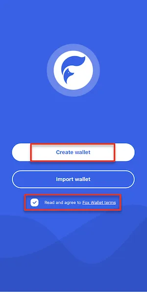
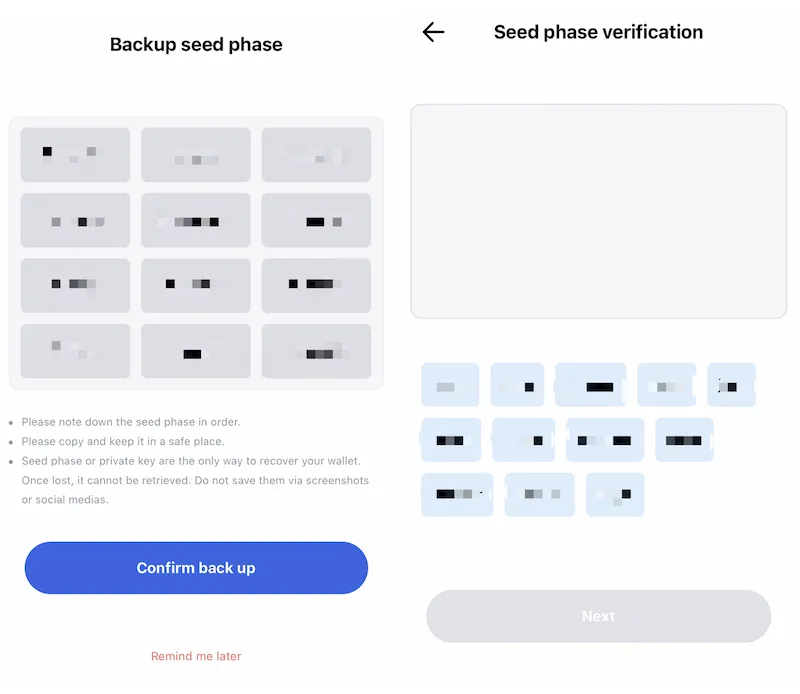
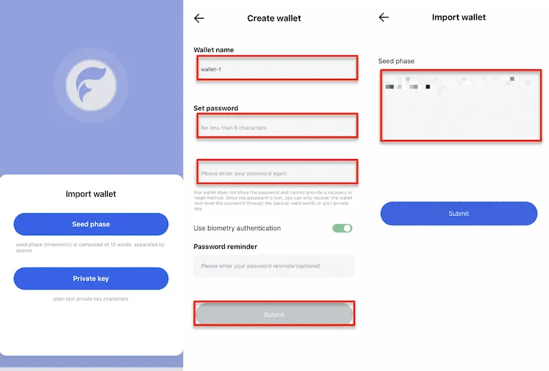
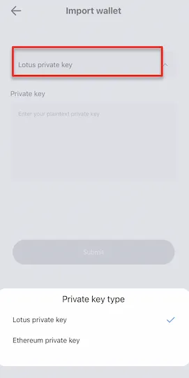

# Create & Import Wallet

Read the “FoxWallet terms” if you are opening the wallet for the first time. 

Click “Create wallet”, and set the “Wallet name”, “Password” and “Password reminder” according to the prompts on the page. 

Keep in mind that FoxWallet DOES NOT store the password NOR retrieve it for you. 

After entering all the information, click “Submit”.

At this point, your wallet has been created, and you can choose to back up the seed phrase immediately or later.

If you choose to back up the seed phrase immediately, noting down your seed phases, and click “Confirm back up” to the verification session. 

Enter the 12 seed phrase in the verification box according the sequence you have backed up, and click “Next” to complete the backup.

If you choose to back up your seed phrase later, click “Remind me later” to enter the” Wallet” page. The backup of seed phrase and private key can be done through” Wallets” on the” Me” page.

### If you already have a wallet, directly select “Import Wallet”.

In FoxWallet, you can restore the wallet by importing seed phrase or private key. Select the corresponding method, enter the information according to the prompts on the page. Click “Submit” to complete the import.

If you choose to restore the wallet by importing the private key, confirm the private key type, and then enter the private key. After that, click “Submit” and you will enter the” Wallet” page.

