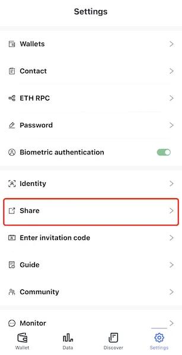
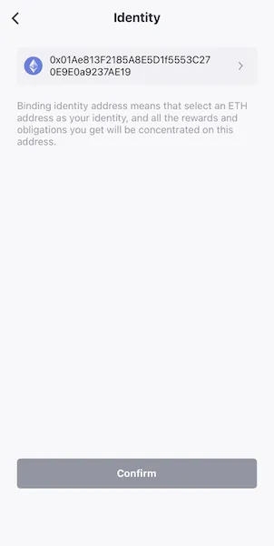
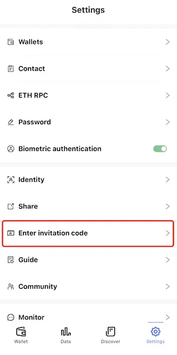

# Invite
Invite your friends to [download FoxWallet](https://foxwallet.com/download), and enter invitation code.

## 1. Get your invitation code

* Click the “Share” menu in "Me" page
  
  
* If your haven't bind identity，click “Bind Identity First” and choose an ETH account as your identity.
  
  
* Click "Get Invitation Code" in "Share" page, you should be able to see the invitation code after pass the verification.
  
  

## 2. Invite your friends to download FoxWallet

* Click "Share link" or "Share picture" button in "Share" page 
* You can send the FoxWallet official website url `https://foxwallet.com/` too.

## 3. Enter invitation code

* Copy and send your invitation code to your friends
* Let your friends click the "Enter invitation code" menu in "Me" page
  
  
* click “Bind Identity First” and choose an ETH account.
* Enter invitation code
  
  