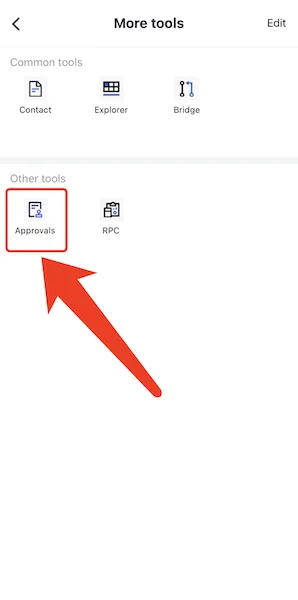
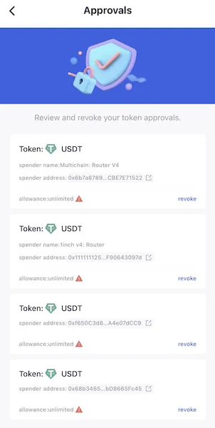

# Approval Management

Token approval is a method which allows a smart contract or another address to withdraw funds from the address sending the transaction. 

In most cases, this has to be done before a token trade or depositing funds into a smart contract like adding liquidity. 

Most protocols have users approve an infinite amount of tokens so they would never need to approve the asset again, but this can be dangerous. 

Once an approval is granted, some smart contracts may be able to execute transactions without further approval or action from the wallet owner. 

**With FoxWallet's Token Approvals feature, you have a clear view of all the smart contracts and corresponding tokens you have allowed to spend on your behalf. Easily revoke your approval or decrease the approved amounts.**

* Open FoxWallet, click the "More" button  

* Click the "Approvals" button in the tools page  
  

* Review and revoke your token approvals  
  
