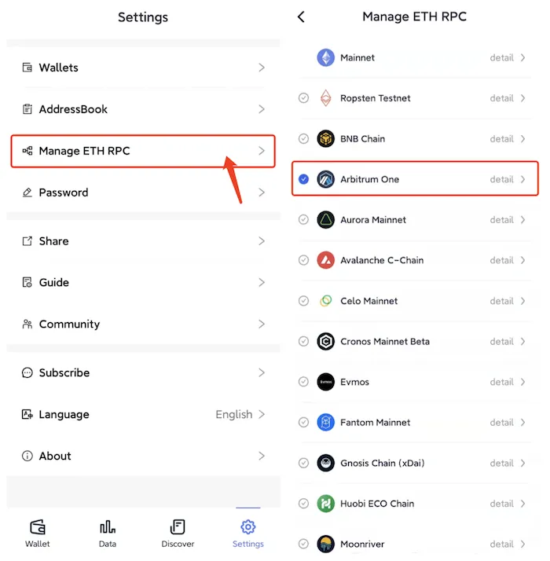
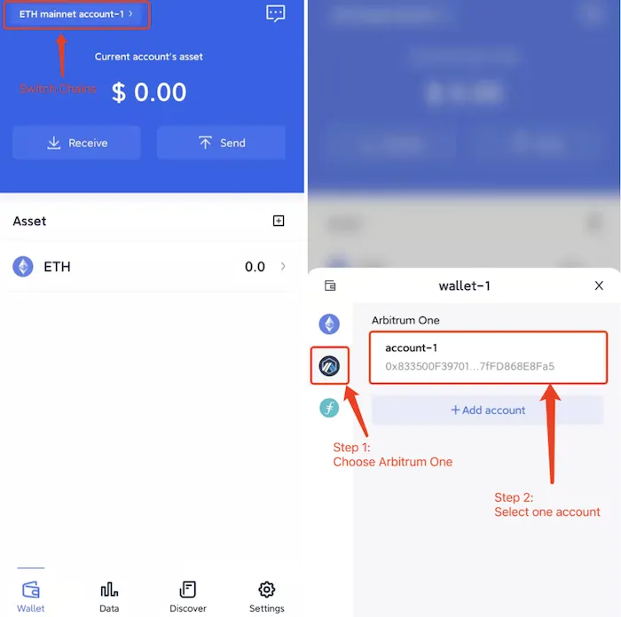

# Arbitrum One

```mdx-code-block

<span> </span>

```
[FoxWallet](https://foxwallet.com) is the best Arbitrum wallet, the best layer2 wallet.

## Add Arbitrum One

“Setting” => “Manage ETH RPC” => Enable Arbitrum One => Back to wallet main page.



## Switch to Arbitrum One

Click the switch button in main page => Choose Arbitrum One => Select one
account.

