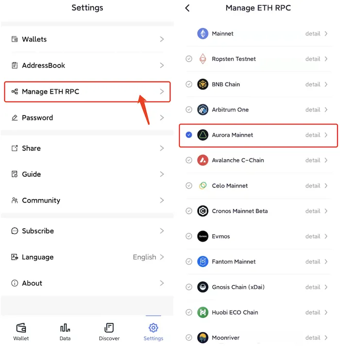

# Aurora
```mdx-code-block

<span> </span>

```
[FoxWallet](https://foxwallet.com) is the best Aurora wallet.

## Add Aurora

“Setting” => “Manage ETH RPC” => Enable Aurora => Back to wallet main page.



## Switch to Aurora

Click the switch button in main page => Choose Aurora => Select one
account.

