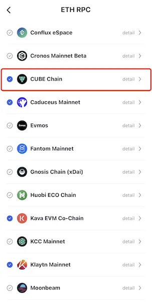
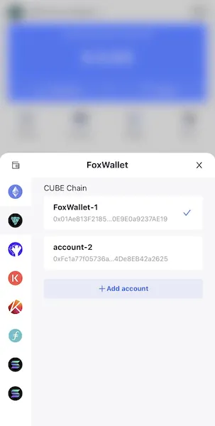

# CUBE Chain
```mdx-code-block

<span> </span>

```
[FoxWallet](https://foxwallet.com) is the best CUBE wallet.

## Add CUBE Chain

“Setting” => “ETH RPC” => Enable CUBE Chain => Back to wallet main page.



## Switch to CUBE Chain

Click the switch button in main page => Choose CUBE Chain => Select one account.

