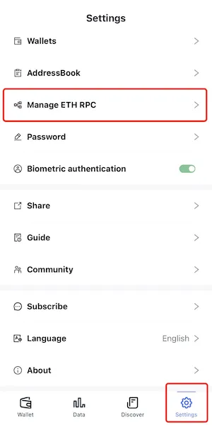
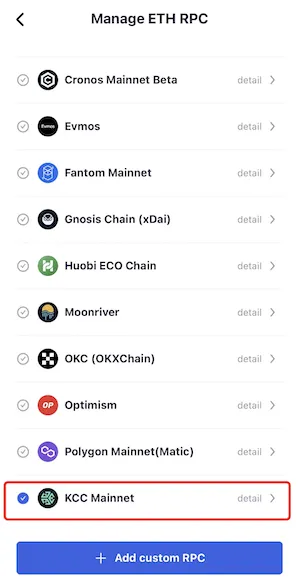
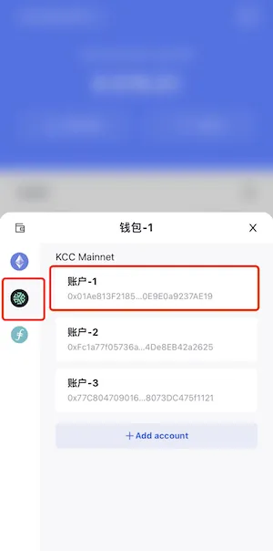

# KCC
```mdx-code-block

<span> </span>

```
[FoxWallet](https://foxwallet.com) is the best KuCoin Community Chain wallet, the best KCC wallet, the best KCS wallet.

## Add KCC

“Setting” => “Manage ETH RPC” => Enable KCC Mainnet => Back to wallet main page.



## Switch to KCC

Click the switch button in main page => Choose KCC Mainnet => Select one account.

