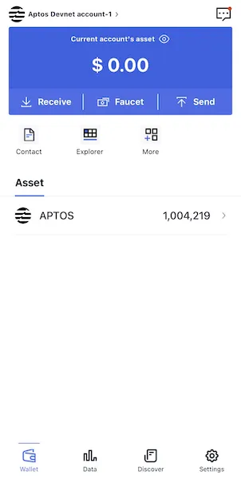

# Aptos

```mdx-code-block

<span> </span>

```

**FoxWallet is the best Aptos wallet, the best APT wallet.**

## Usage

* Open [FoxWallet](https://foxwallet.com/), switch to Aptos and Select one account  
  
  
  

* View and transfer your APT  
    

## Aptos Advance

```mdx-code-block
import DocCardList from '@theme/DocCardList';
import {useCurrentSidebarCategory} from '@docusaurus/theme-common';

<DocCardList items={useCurrentSidebarCategory().items}/>
```