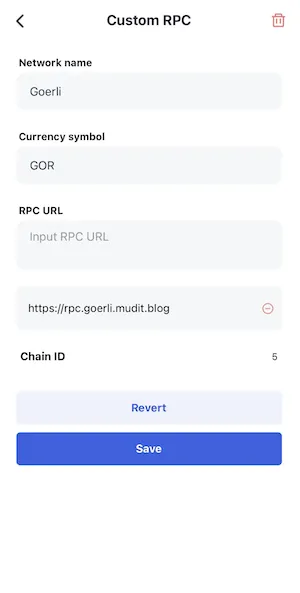
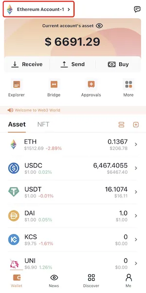
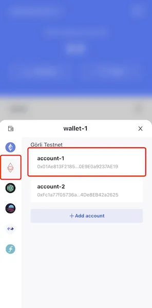

# Ethereum Goerli Testnet (Görli)

## Add Network
"Me" => "Networks" => Enable `Goerli Testnet` => Back to wallet tab.

## Switch Network
Click the switch button in the top-right corner => Choose `Goerli Testnet` => Select one account.

## Goerli Faucets
* https://faucet.goerli.mudit.blog/
* https://goerli-faucet.slock.it/
* ​https://faucets.chain.link/goerli
* ​https://faucet.paradigm.xyz/
* https://goerlifaucet.com/
* https://fauceth.komputing.org/?chain=5
* https://www.allthatnode.com/faucet/ethereum.dsrv
* https://faucet.quicknode.com/ethereum/goerli

## Buy Goerli with Mainnet ETH
* https://testnetbridge.com/