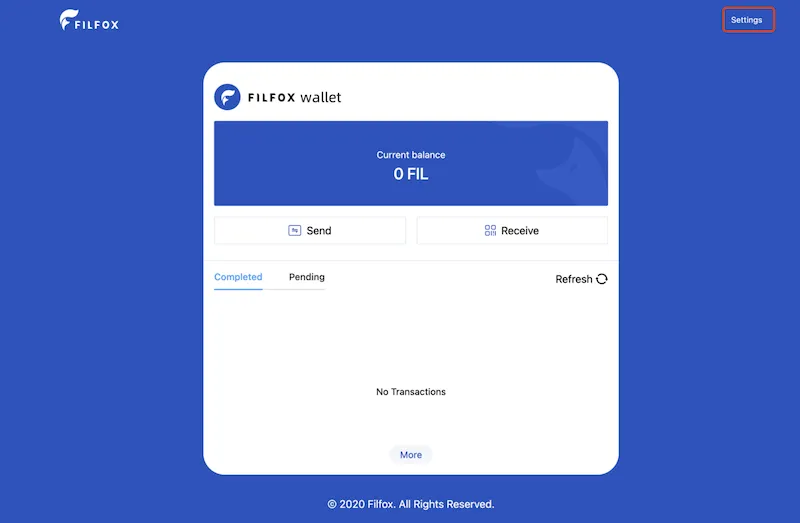
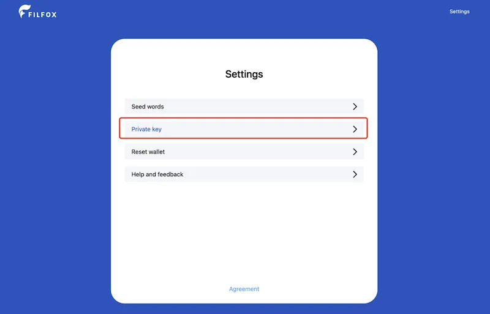
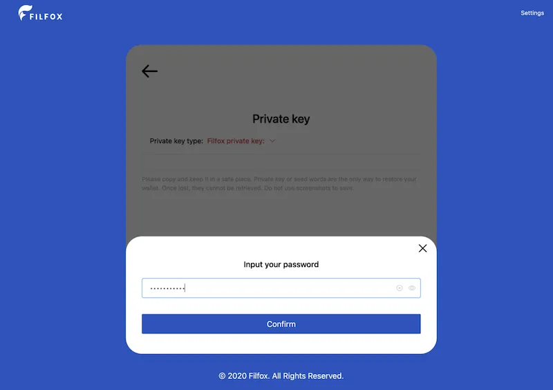
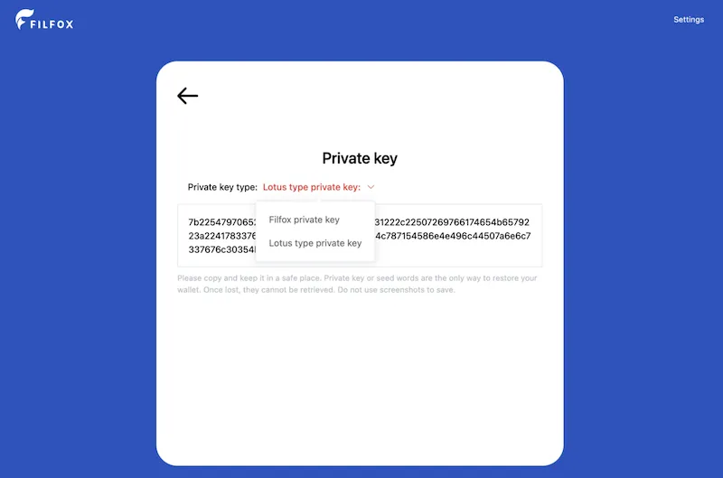
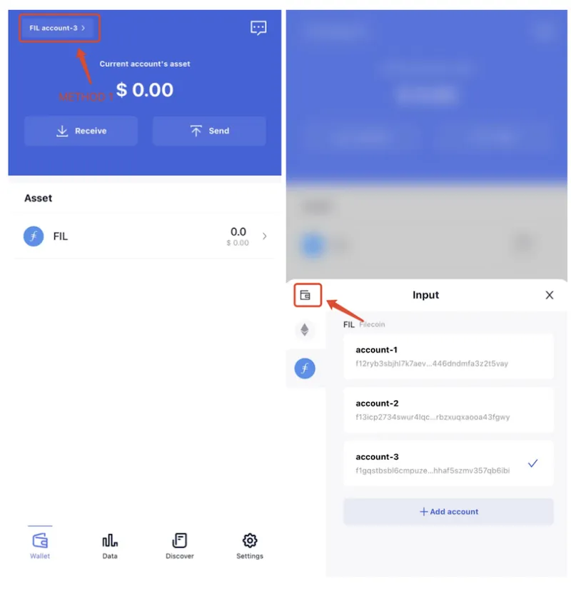
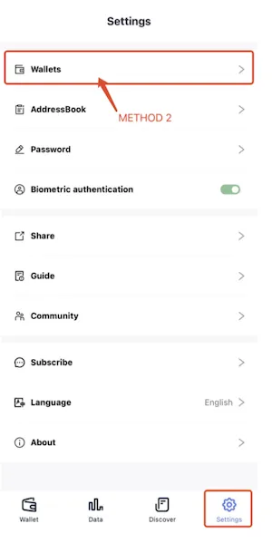
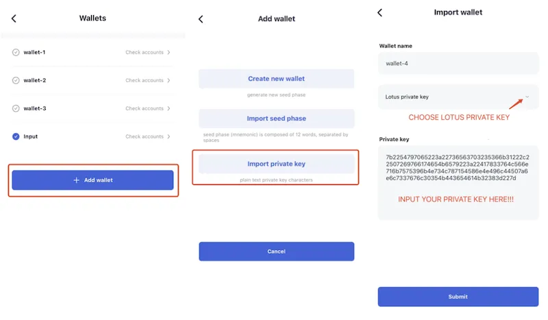

# Import Wallet From Filfox
Due to some historical reasons, the mnemonic of the Filfox web wallet is not compatible with other wallets. 

If the mnemonic of the Filfox web wallet is directly imported into other wallets, different addresses will be obtained.

This article introduces a method to import the address from the Filfox web wallet into FoxWallet through the private key.

## 1. Export private key from FILFox

Login your FILFox Web Wallet：[https://wallet.filfox.info](https://wallet.filfox.info)

Go to Settings —> Private key —> Input your password and comfirm —> Choose Lotus type private key —> Copy private key.

## 2. Import to FoxWallet

There are two ways to add a wallet, one is to click the switch button at the top left of the homepage to add a wallet. 

The other is to click “Wallets” button in “Settings” page.

When you will enter the “Wallets” page:

Click "Add wallet" —> Import private key —> set your wallet name and choose “Lotus private key” —> input your private key —> Submit.

Congratulations! You have imported your FILFox Web Wallet to FoxWallet successfully! And now, just enjoy surfing in FoxWallet！
