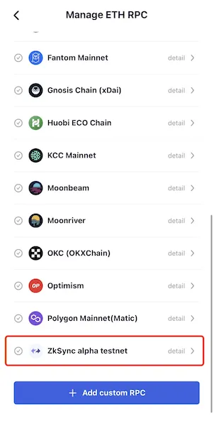
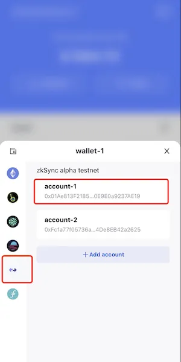
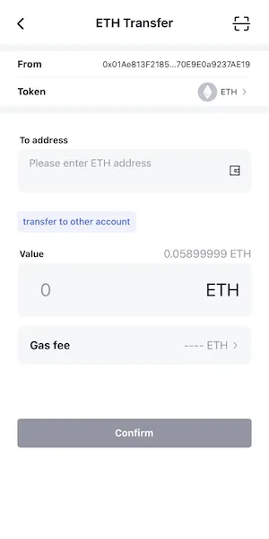

# zkSync 2.0 Alpha Testnet
```mdx-code-block

<span> </span>

```
[FoxWallet](https://foxwallet.com) is the best zkSync wallet, the best zkSync 2.0 alpha testnet wallet.

## Add zkSync Alpha Testnet

"Me" => "Networks" => Enable zkSync Alpha Testnet => Back to wallet main page.



## Switch to zkSync Alpha Testnet

Click the switch button in main page => Choose zkSync Alpha Testnet => Select one account.



## Get testnet coin and bridge

* [Official Portal](https://portal.zksync.io/)
* Community Faucet:
  * https://zksync2-ethdrop.herokuapp.com/
  * https://syncswap.xyz/


## Transfer

FoxWallet brings the native funds management support for zkSync 2.0 alpha tetsnet. Simply click the "Send" button in wallet tab, and input the destination address and amount.



## Dapps

* https://testnet.switch.mute.io/
* https://syncswap.xyz/
* https://tofunft.com/zksync
* https://zksync-testnet.sat.is/