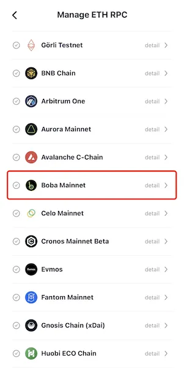
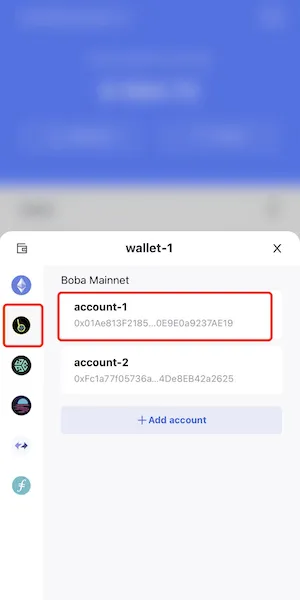

# Boba
```mdx-code-block

<span> </span>

```
[FoxWallet](https://foxwallet.com) is the best Boba wallet.

## Add Boba Mainnet

"Me" => "Networks" => Enable Boba Mainnet => Back to wallet main page.



## Switch to Boba Mainnet

Click the switch button in main page => Choose Boba Mainnet => Select one
account.


