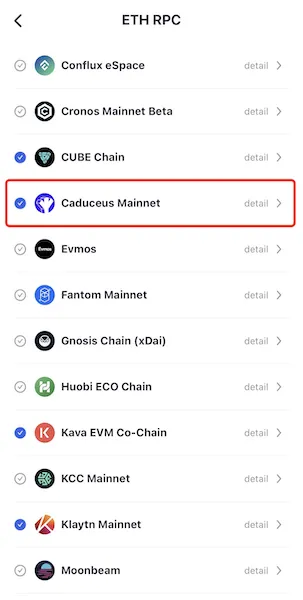
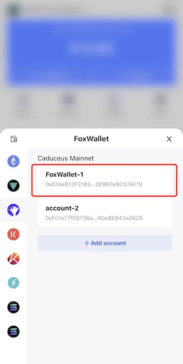

# Caduceus Mainnet
```mdx-code-block

<span> </span>

```
[FoxWallet](https://foxwallet.com) is the best Caduceus wallet, the best CMP wallet.

## Add Caduceus Mainnet

"Me" => "Networks" => Enable Caduceus Mainnet => Back to wallet main page.



## Switch to Caduceus Mainnet

Click the switch button in main page => Choose Caduceus Mainnet => Select one account.


