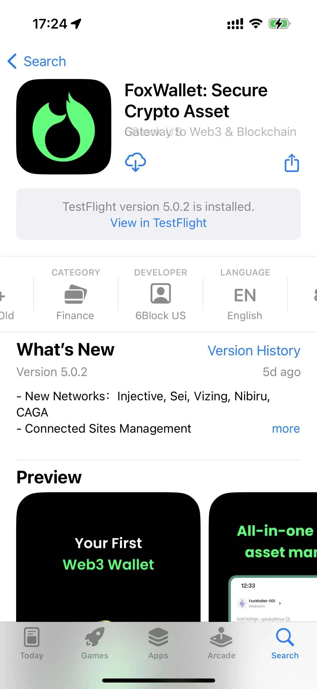
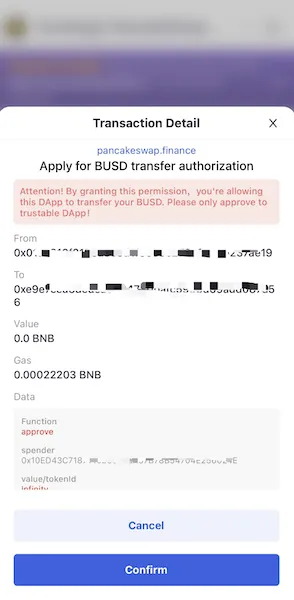

# Protecting Your Crypto Currency - Security Tips

## 1. Download FoxWallet from official website 

Make sure the domain name of FoxWallet's official website is **https://foxwallet.com**. And there's a [🔒] symbol in front of the domain name, which means "Connection is secure".

When download from [AppStore](https://apps.apple.com/us/app/foxwallet-secure-crypto-asset/id1590983231), make sure the `DEVELOPER` name is **6Block US**.  
 
When download from [Google Play](https://play.google.com/store/apps/details?id=com.foxwallet.play), make sure the `DEVELOPER` name is **6Block**.    

  

## 2. Use strong passwords

When creating a wallet or cryptocurrency exchange account, you always need to use an extremely secure password. 

Here are some tips on creating a strong password:
* Use a combination of alphabets, numbers, and special characters
* Use lowercase and upper case
* Minimum 8 letters

## 3. Backup your seed phrase in a safe place

The seed phrase is a 12 or 24-word phrase that lies at the core of private key generation for every cryptocurrency you hold. 

Your seed phrase is the only backup to your private keys, which can give you access to your crypto assets. 

And there is no “forgot your password” option you can rely on.If you lose your seed phrase, you also lose access to your wallet, with no exceptions.

* **Never take a screenshot of your seed phrase.**
* **Never store your seed phrase on any application or device that is connected to the internet.**
* **Always go for offline methods. While paper and offline documents on flash drives serve the purpose, steel capsules take your seed phrase’s security to the next level.**

## 4. Take care of signing and transactions from dApps

When using dApps, FoxWallet can show the detail informations and warning for risky operations. 

**You should check the website domain、transfer value and destination、message content to sign、function to call carefully, and take care of the warning message.**

## 5. Beware of Phishing Scams

Phishing scams are growing in popularity over the past couple of years as more and more people get involved in the cryptocurrency field.

Never visit websites you don’t trust. Always check if the link showing in your browser perfectly matches the one of your exchange or web wallet.

Scammers can use free airdrop events with posters or links to promote in the community. If the user scans the code, enters the website and approves to receive airdrop tokens. After approval, the scammers obtain permission to transfer away user assets easily. 

Another common scam is fake token, scammers counterfeit tokens by using similar token names and symbols, and then they will exchange for real tokens. It is necessary to check the token contract and other information according to the official token information before making a transfer and do not trust a third party easily!

**There is no free meal in the world, do not click any unknown link to receive airdrops, or scan the code to approve your applications. More importantly, do not send the private key/mnemonic to anyone!**

**FoxWallet will bring phishing token and website check soon.**
