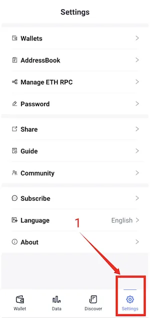
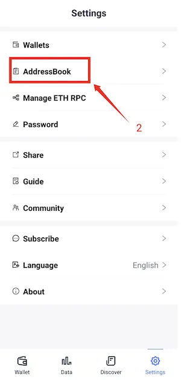
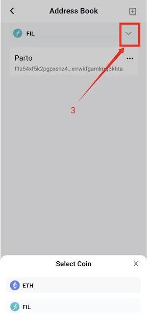
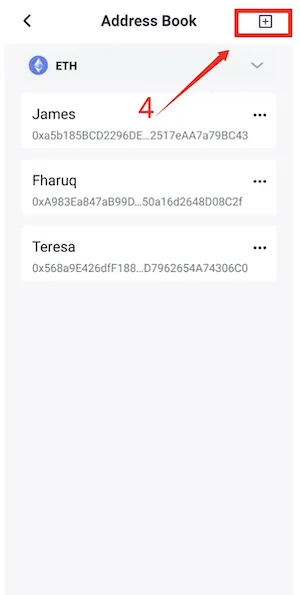
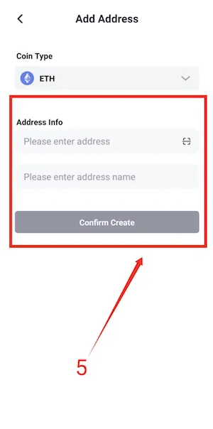
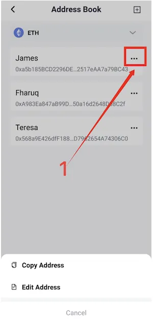
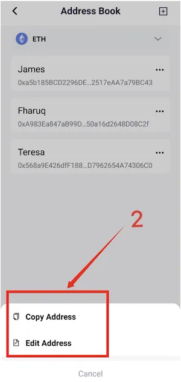
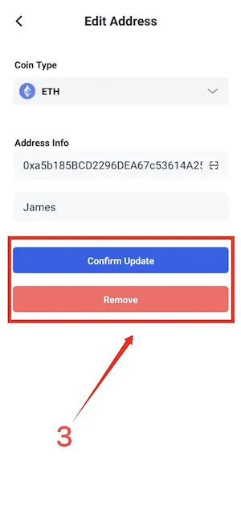

# Address Book

FoxWallet has interesting features, one of which is AddressBook. With this feature, users can save other people’s cryptocurrency wallet addresses. 

By taking advantage of this feature, users will easily send assets to known people and their cryptocurrency wallet addresses will be recorded in the AddressBook. 

This feature also minimizes the risk of manual typing errors in cryptocurrency addresses if you want to transact using FoxWallet.

## Add address

1. Open "SETTINGS" Menu

2. Click AddressBook

3. Select the network for the address you want to save

4. Click the "+" button to add an address

5. Fill in the address and provide a name

## Edit Address Info

1. Click the "..." button to carry out the editing process

2. Click "COPY" to copy the address, and click "EDIT" to change the name and/or address

3. Click "CONFIRM UPDATE" to complete the editing process or select "REMOVE" to delete address in AddressBook.

