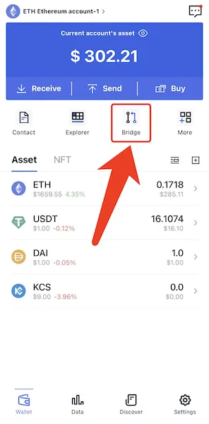
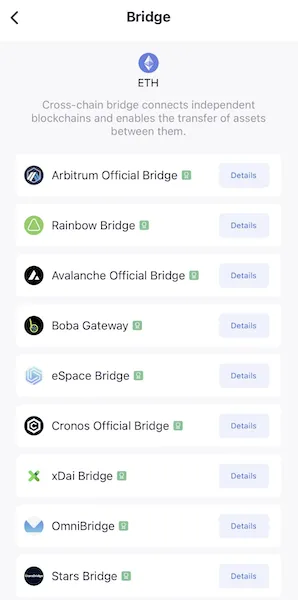

# Cross-Chain Bridge

A cross-chain bridge enables an exchange of information, cryptocurrency or NFTs from one blockchain network to another. 

It enables the flow of data and tokens across what would otherwise be siloed sets of data on different blockchains.

**FoxWallet brings you an easy access to all the popular and reliable cross-chain bridges.**

* Open FoxWallet, click the "Bridge" button  
  

* Select one of your favorite cross-chain bridge to operate  
  
