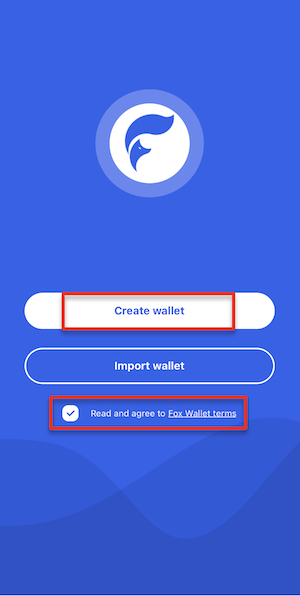
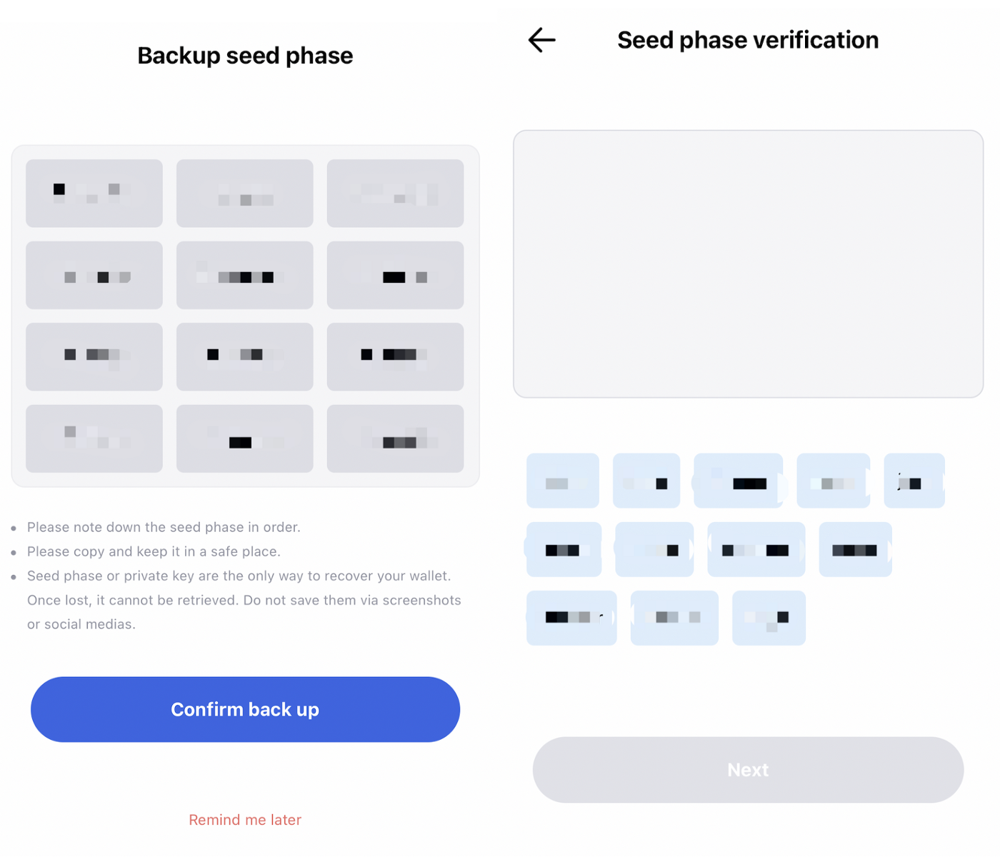
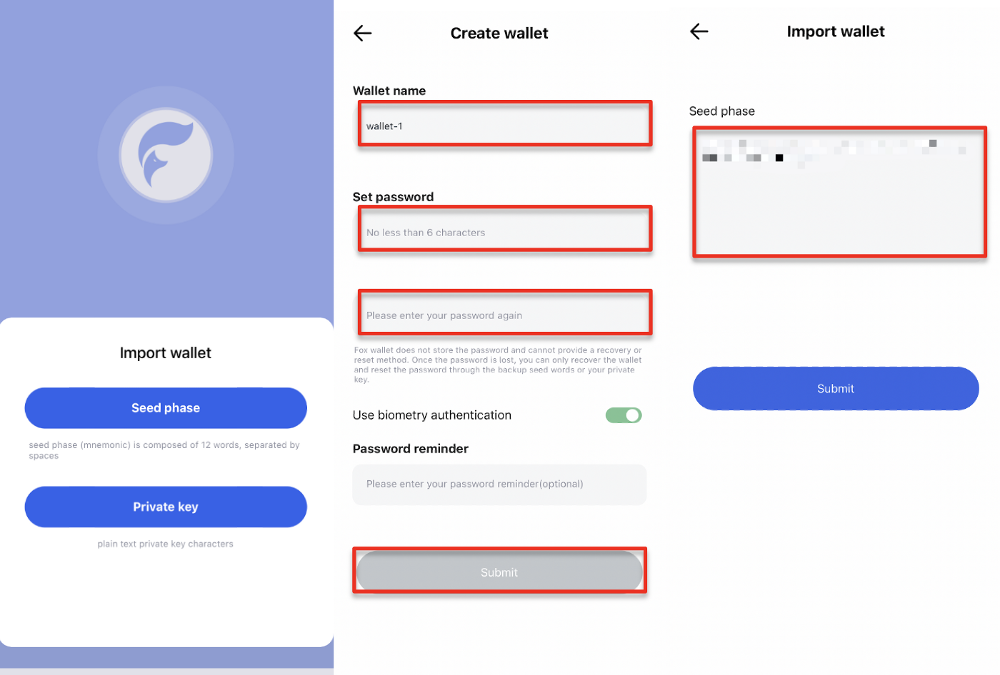
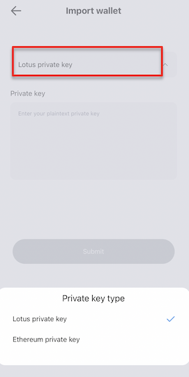

# Create & Import Wallet

Read and check the “FoxWallet terms” first after opening the wallet. 

Click “Create wallet”, and set the “Wallet name”, “Password” and “Password reminder” according to the prompts on the page. 

FoxWallet does not store the password, nor retrieve it for you, so please keep it in mind. 

After entering all the information, click “Submit”.

At this point, your wallet has been created, and you can choose to back up the seed phase immediately or later.

If you choose to back up the seed phase immediately, after recording the seed phase, click “Confirm back up” to the verification session. 

Enter the 12 seed phase in the verification box according the sequence you have backed up, and click “Next” to complete the backup.

If you choose to back up your seed phase later, click “Remind me later” to enter the” Wallet” page. The backup of seed phase and private key can be done through” Wallets” on the” Settings” page.

### If you already have a wallet, directly select “Import Wallet”.

In FoxWallet, you can restore the wallet by importing seed phase or private key. Select the corresponding method, enter the information according to the prompts on the page. Click “Submit” to complete the import.

If you choose to restore the wallet by importing the private key, confirm the private key type, and then enter the private key. After that, click “Submit” and you will enter the” Wallet” page.

