# zkSync 1.0 Tutorial

zkSync is a trustless protocol for scalable low-cost payments on Ethereum, powered by [zkRollup technology](https://docs.zksync.io/userdocs/tech.html#zk-rollup-architecture), from [Matter Labs](https://matter-labs.io/). It uses zero-knowledge proofs and on-chain data availability to keep users' funds as safe as though they never left the mainnet.

**Some of the main features of zkSync are:**
* Extremely low transaction fees
* Trustless protocol
* Funds are cryptographically secure, as in the Ethereum mainnet
* Users are always in control of their funds
* No requirement for operational activity to keep the funds safe

zkSync 1.0 lives on Ethereum mainnet already.

Open FoxWallet, [switch network](../manage-funds.md) to "Ethereum mainnet", go to "Discover" and input url https://zksync.io/ or just search zksync to visit.

 

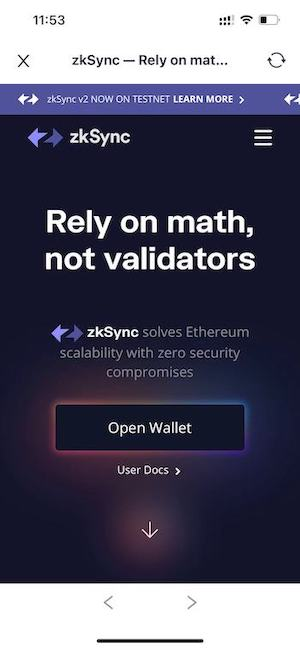

Click "Open Wallet" in the page, then choose "Ethereum Wallet" in the new page.

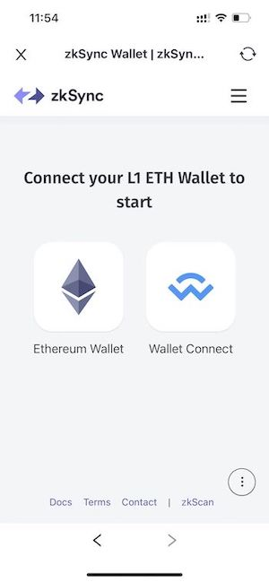

Click "show more", choose "Debug", then select a FoxWallet account to connect, then we reach the wallet main page.

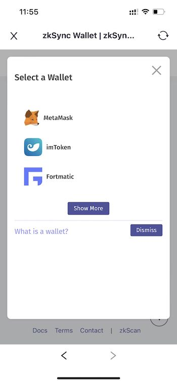 

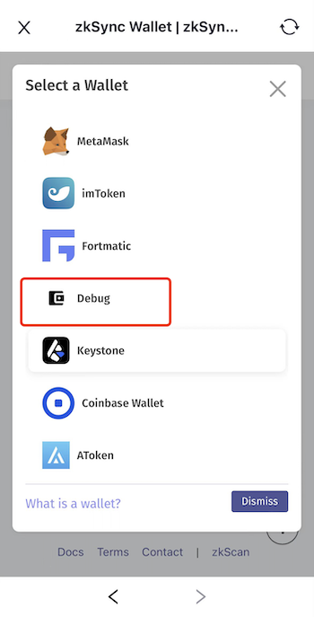 

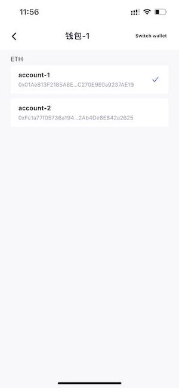

## Add Funds
The "Add Funds" function is used to deposit fund from Layer1.

Click "Add Funds" button, input the amount you want to deposit, then click "Add Funds" below.

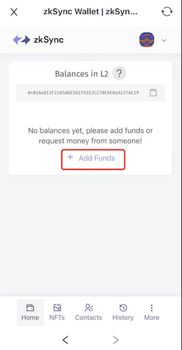

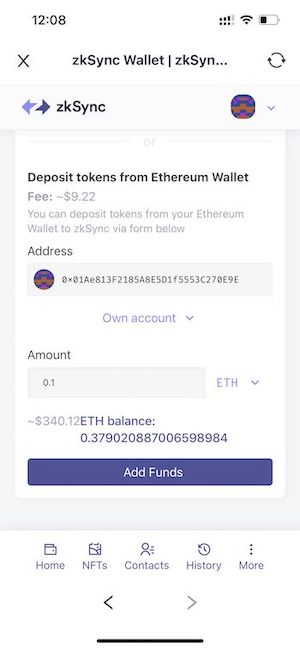

Confirm transaction in the pop-up page, then wait for confirmation, this should take some minutes.

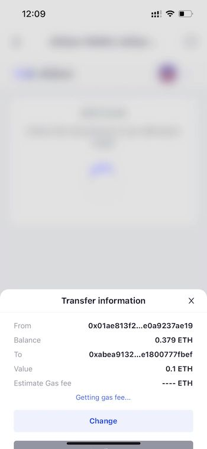 

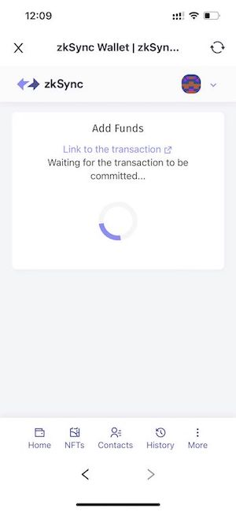

## Transfer

Click "Send" in zkSync wallet page.

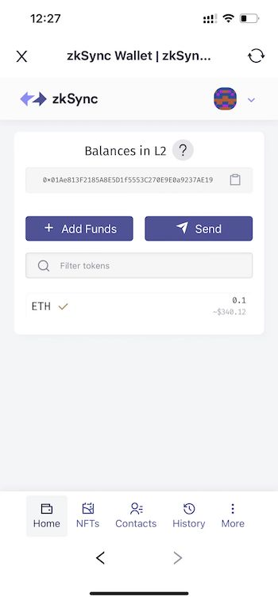

Sign a message to active zkSync account.

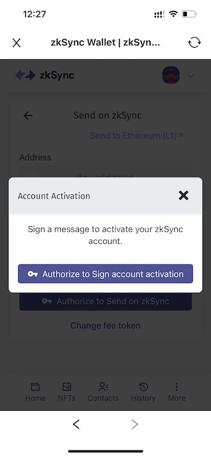

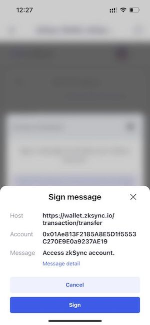

Input address and amount to send.

