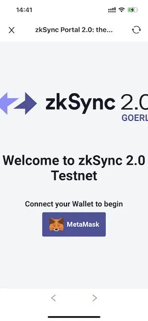
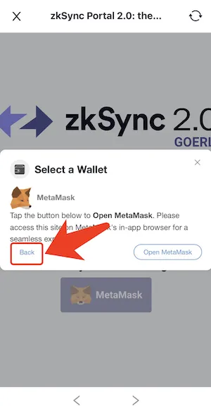
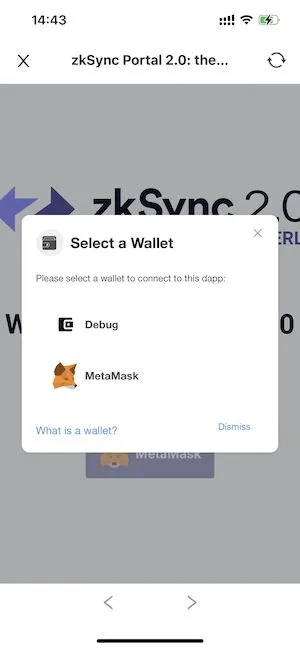
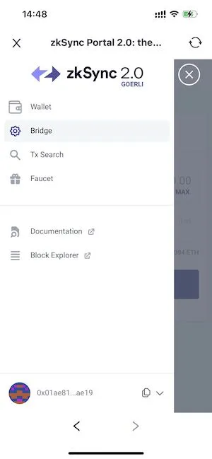
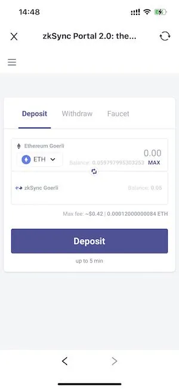
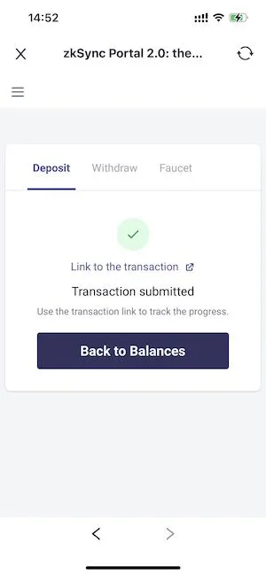
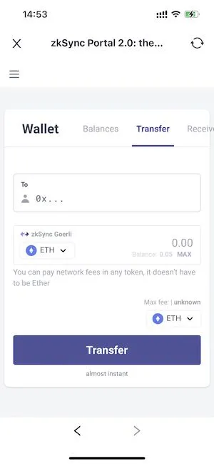

# zkSync 2.0 Testnet Tutorial
zkSync is a trustless protocol for scalable low-cost payments on Ethereum, powered by [zkRollup technology](https://docs.zksync.io/userdocs/tech.html#zk-rollup-architecture), from [Matter Labs](https://matter-labs.io/). It uses zero-knowledge proofs and on-chain data availability to keep users' funds as safe as though they never left the mainnet.

zkSync 2.0 is the first EVM compatiable ZK Rollup on ethereum testnet.

## Add Goerli Testnet
zkSync 2.0 testnet is deployed on the ethereum Goerli testnet.

Open FoxWallet，go to "Settings" tab，click “manage ETH RPC”，scroll to the page bottom，click “Add Custom RPC”, input info and save to add.

Switch network to Goerli, and get some test coin.

For more detailed instruction, visit [Goerli (Görli) Tutorial](../ethereum-advance/eth-goerli-testnet.md)。

## Connect Wallet
Go to "Discover" tab，input https://portal.zksync.io/ in the search bar to visit。

Click the "MetaMask" button，then click the “Back” button in the left bottom corner, choose “Debug” in wallet select page，select a FoxWallet account you want to connect。

## Deposit
Click the menu button on the left top corner, click “Bridge”.

Input amount under “Deposit” tab，and click the “Deposit” button.

Wait a few minutes to let the transaction get confirmed.

## Transfer
Switch to “Transfer” tab in “Wallet” menu, input address and amount, click “Transfer” button and sign message.

