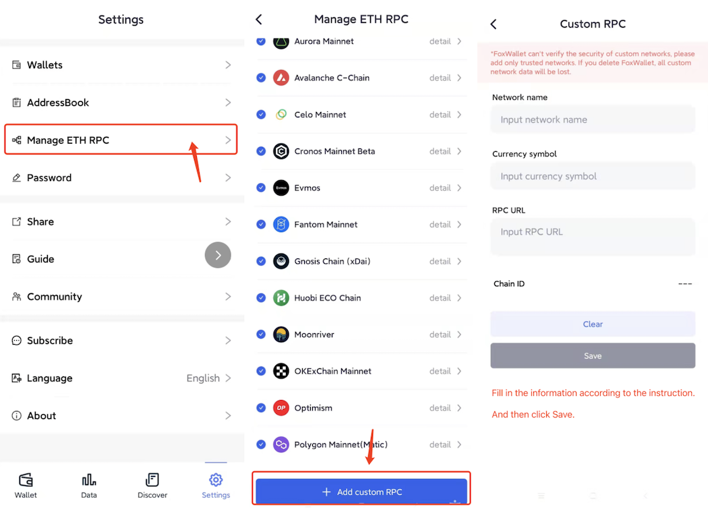

# Add Custom RPC
FoxWallet has built-in the following Ethereum compatible chains: [BNB Chain](./bsc.md), [Arbitrum](./arbitrum.md), [Aurora](./aurora.md), [Avalanche](./avalanche.md), [Celo](./celo.md), [Cronos](./cronos.md), [Evmos](./evmos.md), [Fantom](./fantom.md), [Gnosis](./gnosis.md), [HECO](./heco.md), [KCC](./kcc.md), [Moonriver](./moonriver.md), [OKC](./okc.md), [Optimism](./optimism.md), [Polygon](./polygon.md). 

To use these chains, just enable them in the setting page, no need to manually add custom RPC.

If the chain you want to interact with is not in the above list, you can add it manually: "Settings" => "Manage ETH RPC" => Fill in the information and save.

After the addition is complete, you can click the switch button in the upper left corner of the wallet home page to switch.

