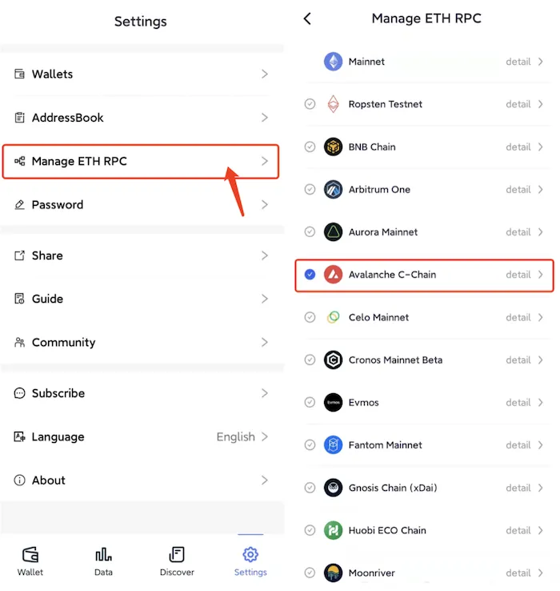
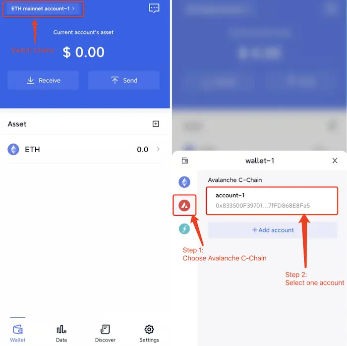

# Avalanche C-Chain
```mdx-code-block

<span> </span>

```
FoxWallet is the best Avalanche wallet, the best AVAX wallet.

## Add Avalanche C-Chain

“Setting” => “Manage ETH RPC” => Enable Avalanche C-Chain => Back to wallet main page.



## Switch to Avalanche C-Chain

Click the switch button in main page => Choose Avalanche C-Chain => Select one account.

