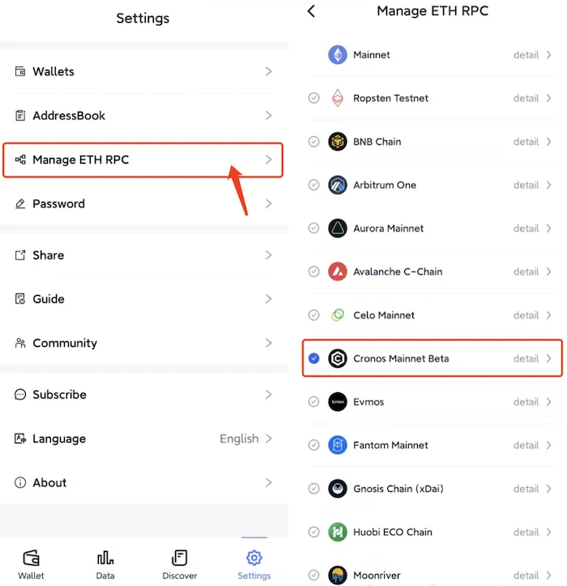
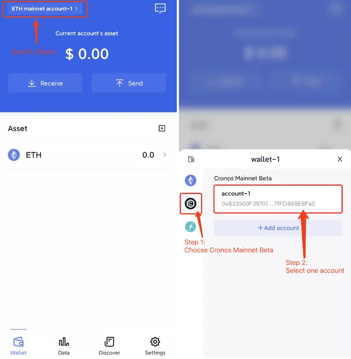

# Cronos Mainnet Beta
```mdx-code-block

<span> </span>

```
[FoxWallet](https://foxwallet.com) is the best Cronos wallet, the best CRO wallet.

## Add Cronos Mainnet Beta

“Setting” => “Manage ETH RPC” => Enable Cronos Mainnet Beta => Back to wallet main page.



## Switch to Cronos Mainnet Beta

Click the switch button in main page => Choose Cronos Mainnet Beta => Select one account.

