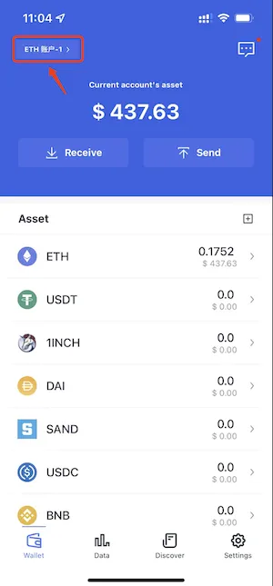

# Ethereum Testnet Goerli (Görli)

## Add Network
Open FoxWallet，Go to "setting" => "manage ETH RPC" => input the below info and save。

* Network name:     `Goerli`
* Currency symbol:  `GOR`
* RPC URL:          `https://rpc.goerli.mudit.blog`

## Switch Network
Back to wallet main page，click the switch button in the top left corner。

## Get Test Coin
Goerli Faucets：
* https://faucet.goerli.mudit.blog/
* https://goerli-faucet.slock.it/
* ​https://faucets.chain.link/goerli
* ​https://faucet.paradigm.xyz/
* https://goerlifaucet.com/
* https://fauceth.komputing.org/?chain=5
