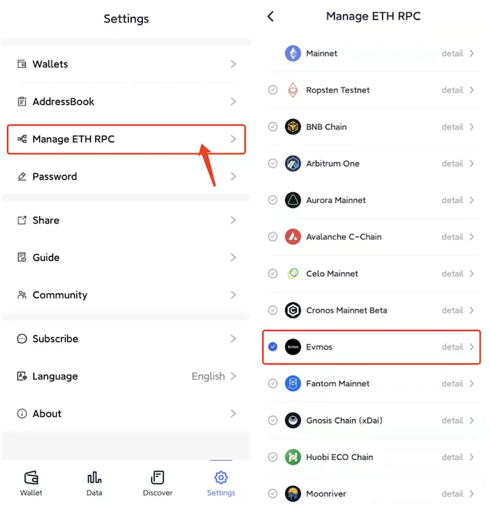
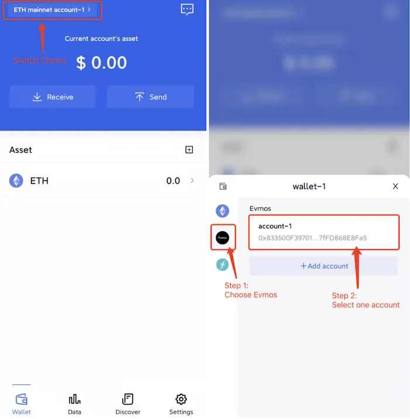

# Evmos
```mdx-code-block

<span> </span>

```
FoxWallet is the best Evmos wallet.

## Add Evmos

“Setting” => “Manage ETH RPC” => Enable Evmos => Back to wallet main page.



## Switch to Evmos

Click the switch button in main page => Choose Evmos => Select one account.

