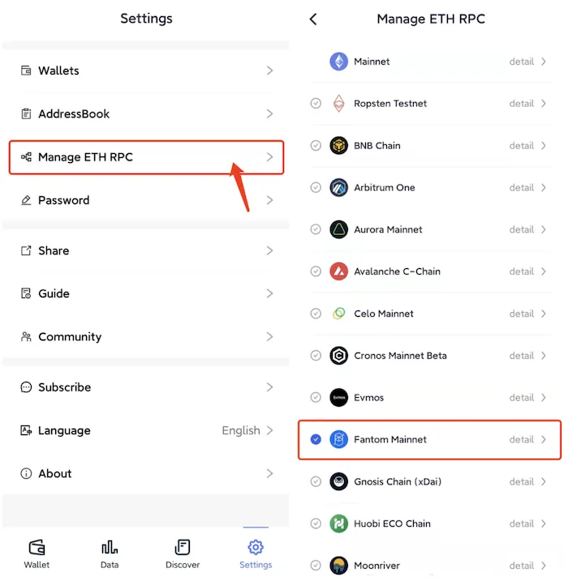
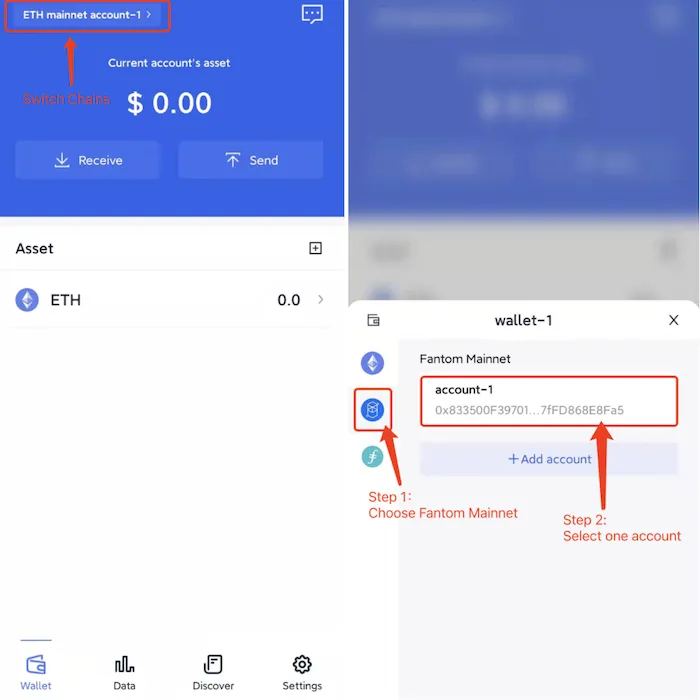

# Fantom
```mdx-code-block

<span> </span>

```
FoxWallet is the best Fantom wallet, the best FTM wallet.

## Add Fantom

“Setting” => “Manage ETH RPC” => Enable Fantom => Back to wallet main page.



## Switch to Fantom

Click the switch button in main page => Choose Fantom => Select one account.

