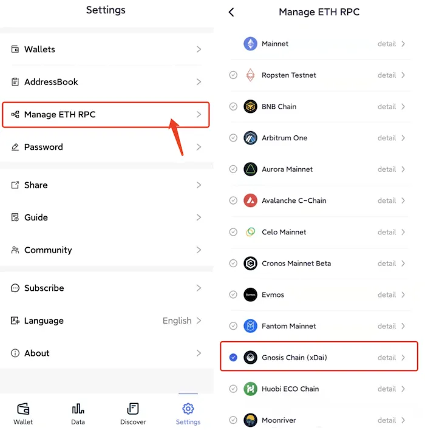
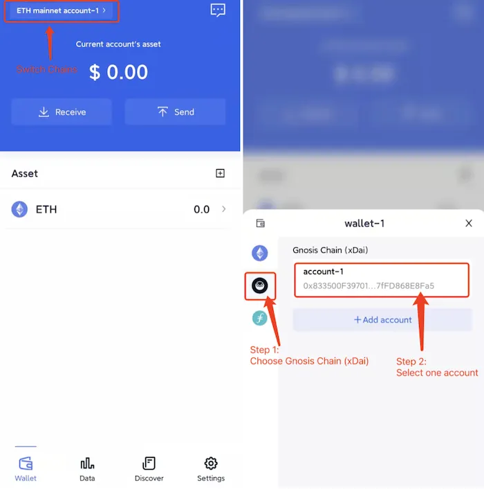

# Gnosis Chain (xDAI)
```mdx-code-block

<span> </span>

```
FoxWallet is the best Gnosis wallet, the best xDAI wallet.

## Add Gnosis Chain

“Setting” => “Manage ETH RPC” => Enable Gnosis Chain => Back to wallet main page.



## Switch to Gnosis Chain

Click the switch button in main page => Choose Gnosis Chain => Select one account.

