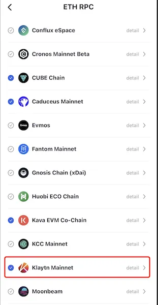
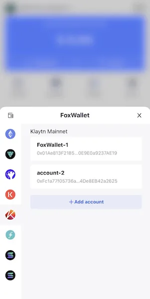

# Klaytn Mainnet
```mdx-code-block

<span> </span>

```
[FoxWallet](https://foxwallet.com) is the best Klaytn Mainnet wallet, the best KLAY wallet.

## Add Klaytn Mainnet

“Setting” => “ETH RPC” => Enable Klaytn Mainnet => Back to wallet main page.



## Switch to Klaytn Mainnet

Click the switch button in main page => Choose Klaytn Mainnet => Select one account.

