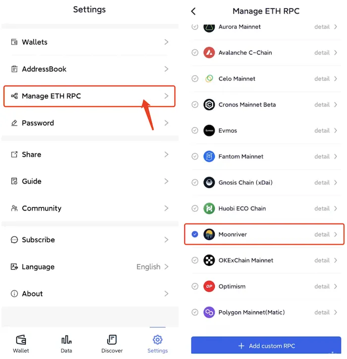
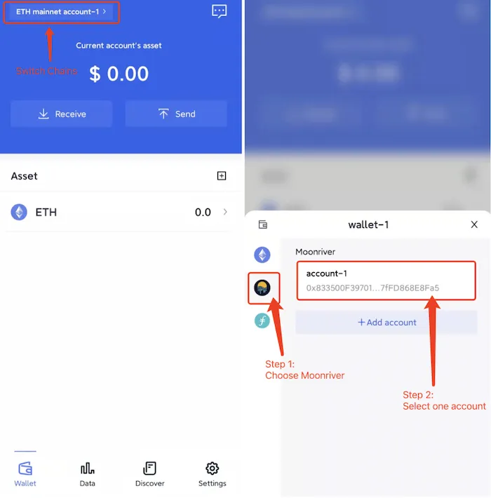

# Moonriver
```mdx-code-block

<span> </span>

```
FoxWallet is the best Moonriver wallet, the best MOVR wallet.

## Add Moonriver

“Setting” => “Manage ETH RPC” => Enable Moonriver => Back to wallet main page.



## Switch to Moonriver

Click the switch button in main page => Choose Moonriver => Select one account.

