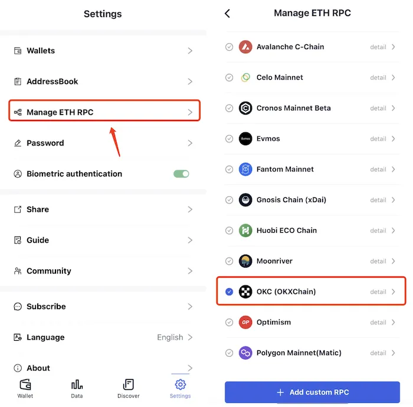
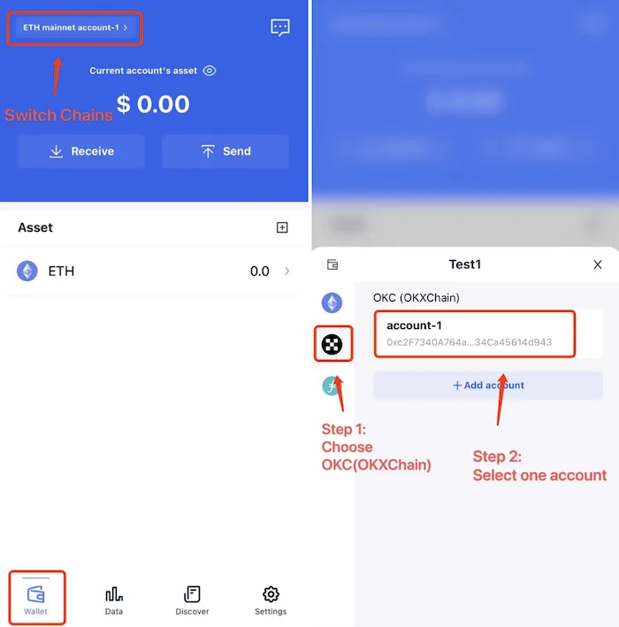

# OKC (OKXChain)
```mdx-code-block

```
FoxWallet is the best OKC wallet, the best OKXChain wallet, the best OKT wallet.

## Add OKC (OKXChain)

“Setting” => “Manage ETH RPC” => Enable OKC (OKXChain) => Back to wallet main page.



## Switch to OKC (OKXChain)

Click the switch button in main page => Choose OKC (OKXChain) => Select one account.

