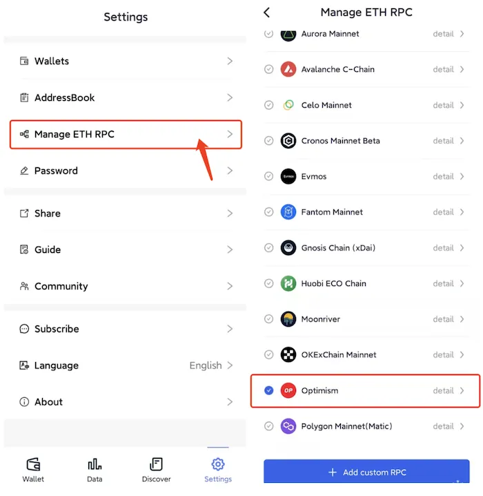
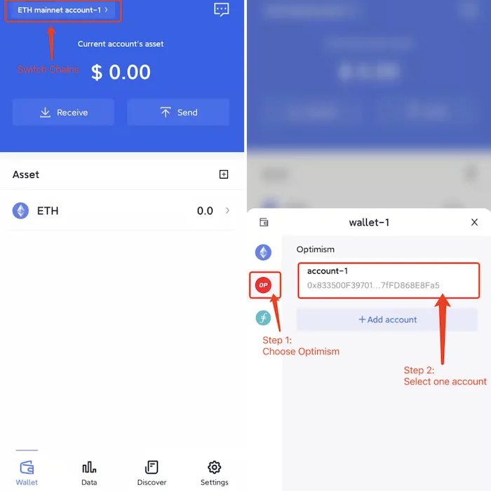

# Optimism
```mdx-code-block

<span> </span>

```
FoxWallet is the best Optimism wallet, the best layer2 wallet.

## Add Optimism

“Setting” => “Manage ETH RPC” => Enable Optimism => Back to wallet main page.



## Switch to Optimism

Click the switch button in main page => Choose Optimism => Select one account.

