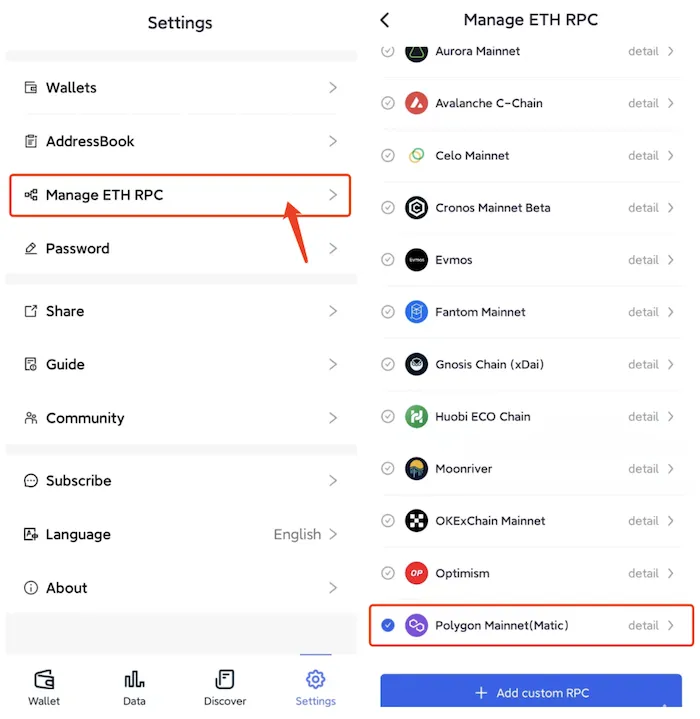
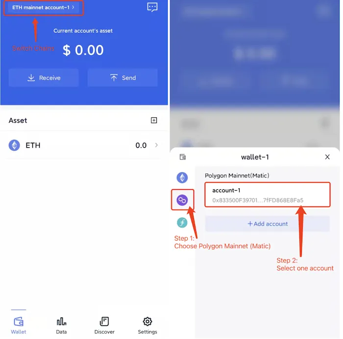

# Polygon (Matic)
```mdx-code-block

<span> </span>

```
FoxWallet is the best Polygon wallet, the best Matic wallet, the best layer2 wallet.

## Add Polygon

“Setting” => “Manage ETH RPC” => Enable Polygon => Back to wallet main page.



## Switch to Polygon

Click the switch button in main page => Choose Polygon => Select one account.

