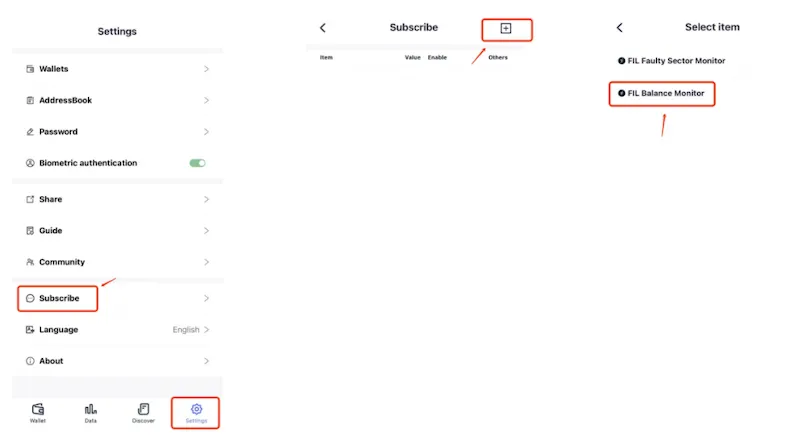
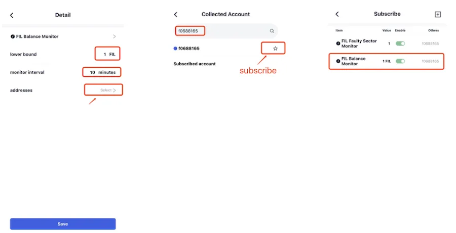

# Balance Monitor
Users can use the FIL Balance Monitor feature to monitor the FIL balance of any address, facilitating them to track the Control address’s balance and ensure that the on-chain fee is sufficient during wdpost checks. 

Click “Settings” => Select “Subscribe” => Click “+” at the top right of the page => Select “FIL Balance Monitor”.

Navigate to the Detail settings page of the “FIL Balance Monitor”, set the “lower bound” and the “monitor interval” parameters that meet your requirements. Click “addresses” to search for the miner ID or address to be monitored in the search bar and enable it. 
Then return to the previous page and click “Save”. You have enabled the feature successfully.

Once FoxWallet detects the balance is below the “lower bound”, a notification will send to your device.

