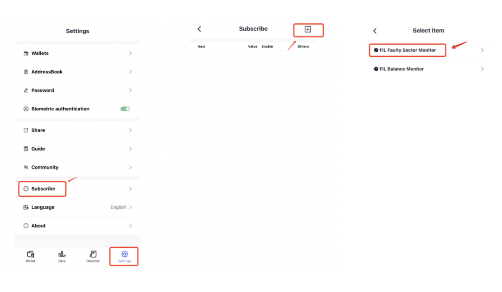
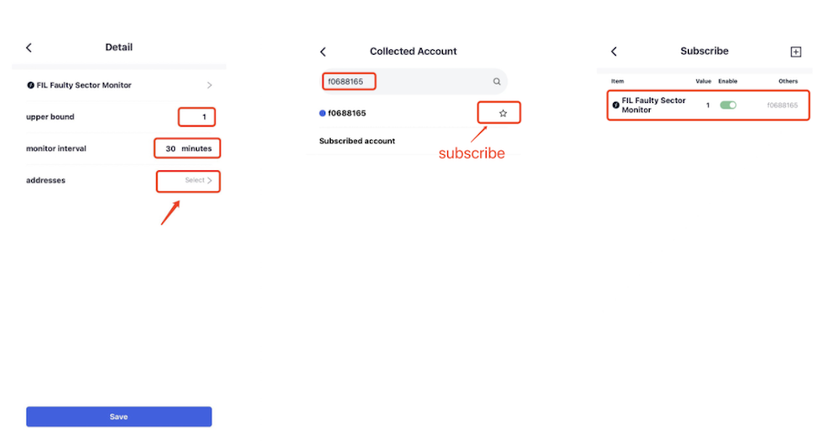

# Faulty Sector Monitor
​​The FIL Faulty Sector Monitor can be employed to track any node’s storage power drops, even if the user does not own the node. 

When the monitor is enabled, the FoxWallet backend will regularly check the node’s faulty sectors and notify users when the quantity exceeds a predefined threshold (The iOS system is preferred as the alert system is more reliable).

Click “Settings” => Select “Subscribe” => Click the “+” button at the top right of the “Subscribe” page => Click “FIL Faulty Sector Monitor”.

Navigate to the Detail setting page of the “FIL Faulty Sector Monitor”, adjust the “upper bound” and “monitor interval” parameters to meet your requirements (typically, use the defaults), and click “addresses” to search for the miner ID or address to be monitored in the search bar. 
Then return to the previous page and click “Save”. You have enabled the monitor successfully. 

Once FoxWallet detects the faulty sector count is beyond the “upper bound”, a notification will send to your device.

## Disable the Faulty Sector Monitor
If you want to turn off the Faulty Sector Monitor of an enabled node, you can disable the “Enable” button of the corresponding node on the “Subscribe” page.

