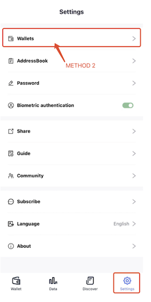
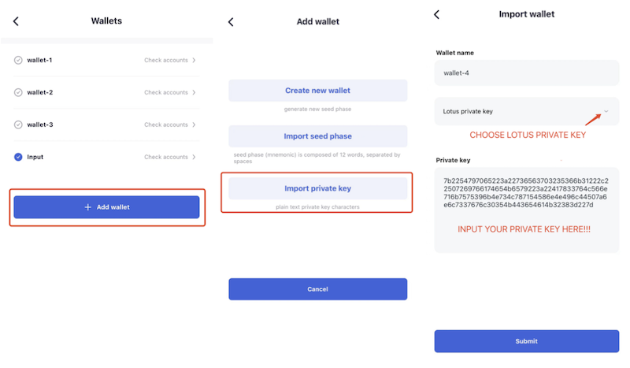
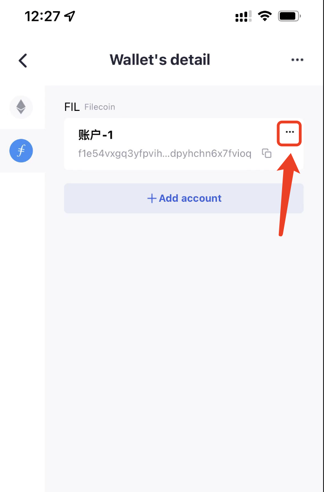
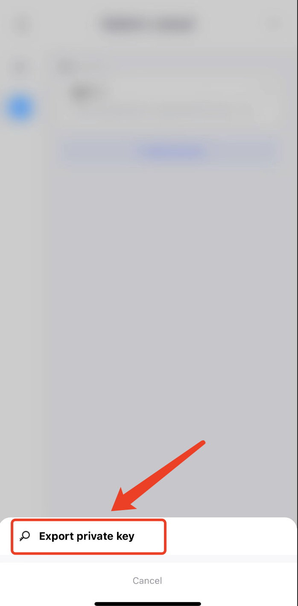
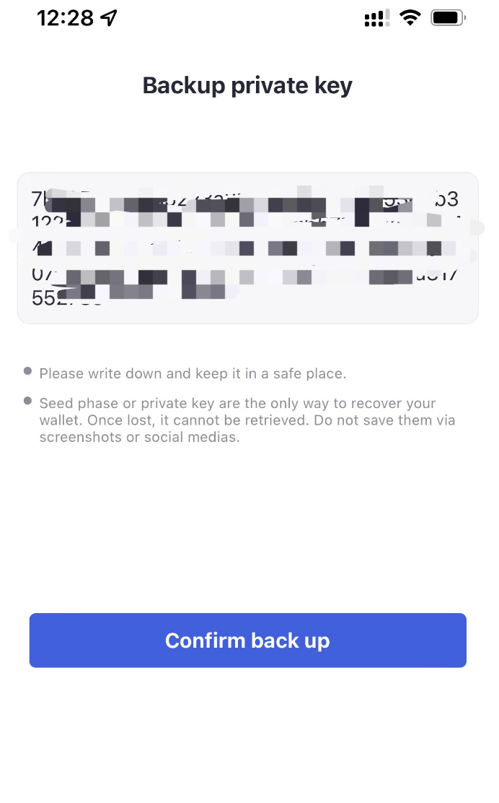

# Interact with lotus

## Import from lotus
### 1. Export private key from lotus  

Use command: `lotus wallet export [address]`

### 2. Import private key to FoxWallet  

Click “Wallets” button in “Settings” page.

And then you will enter the “Wallets” page.

Click "Add wallet" —> Import private key —> set your wallet name and choose “Lotus private key” —> input your private key —> Submit.

## Export to lotus
### 1. Export private key from FoxWallet  

Go to “Wallets” page, click your wallet to the "Wallet's detail" page.

Click the "..." button in your account card.

Choose "Export private key".

Copy your private key.

### 2. Import private key to lotus  

Use command: `echo [private key] | lotus wallet import`