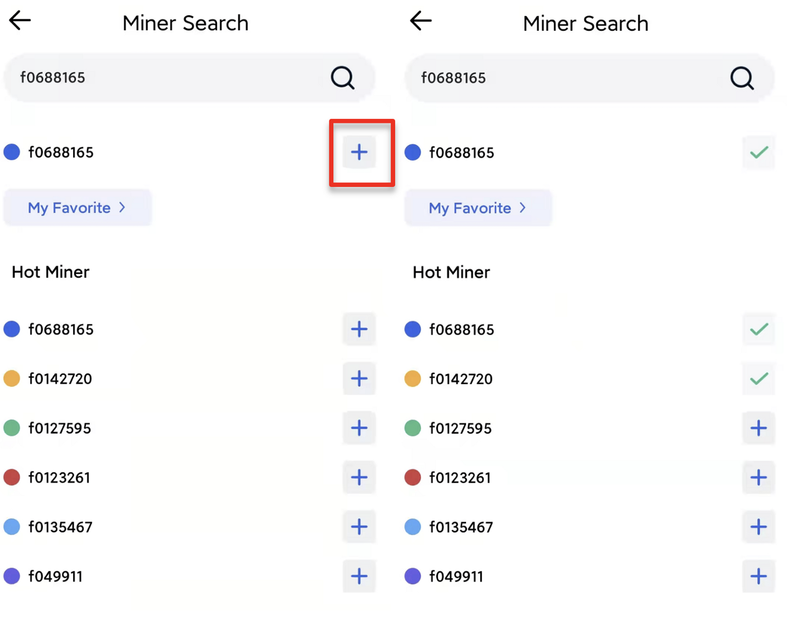

# Subscribe Miner
Click on “Data” in the bottom navigation bar to enter the Filecoin on-chain data display page.

## Subscribe

Click the “Search “ button to enter the page, and enter the miner ID or address to search according to the page displayed. 

According to the search result, click the corresponding sign “+” on the right side, then the subscription is successful. 

Go back to the “Data” page and you can see the relevant information of the node.

## Unsubscribe
Click the “Search” button to enter the page, and select “My Favorite” to enter the management page. Click the corresponding sign “-” to the right of the node to unsubscribe.

