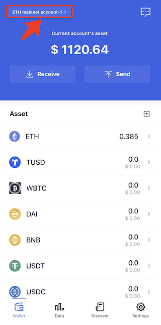
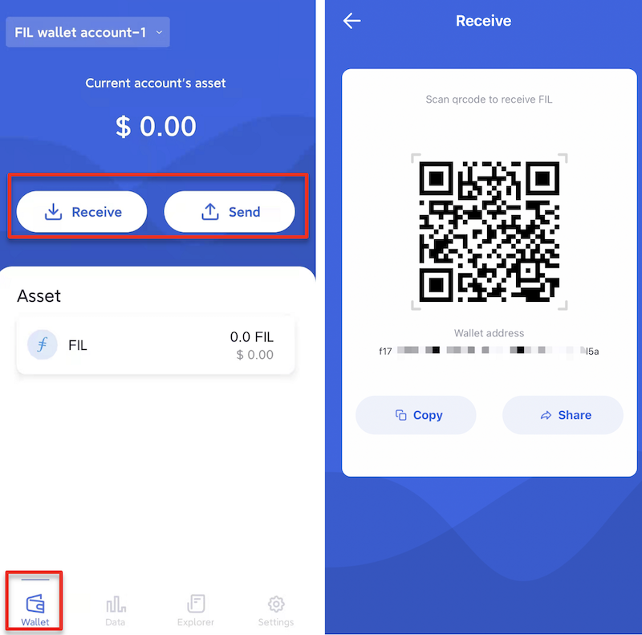
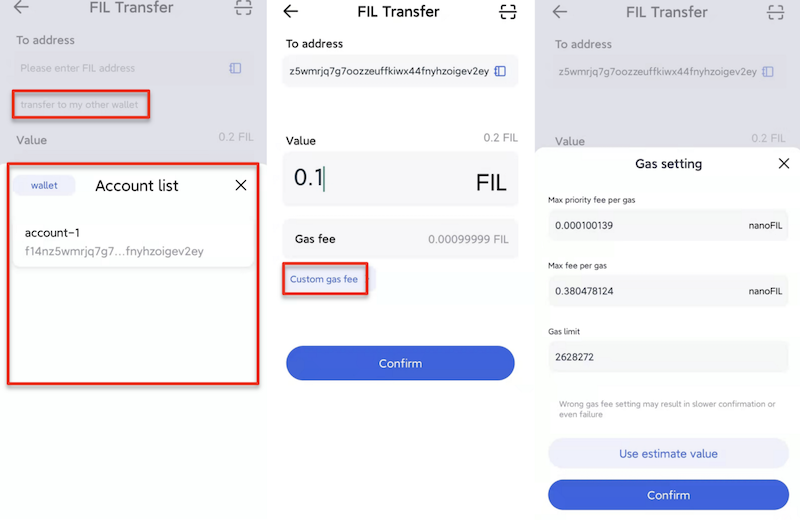

# Manage Funds

### Switch networks
FoxWallet supports multiple chains, you can switch them throw the button on the top left corner of the “Wallet”

### Receive
Click the “Receive” button to get your wallet address.

### Send
The send function is applicable to transfer between accounts in the FoxWallet and transfer to addresses outside the wallet.  

If the address is outside of the FoxWallet, paste the address into the corresponding input box or scan the QR code of the receiving address to make the transfer.  

If the address is inside the wallet, just select the corresponding address in the “transfer to my other wallet” box below the receiving address input box.  

FoxWallet will estimate the gas fee and fill it automatically, and users can also manually adjust it using the “Custom gas fee” feature.

### Transaction records
Click on the asset in the “Asset” list to enter the asset details page and view historical transaction records.

