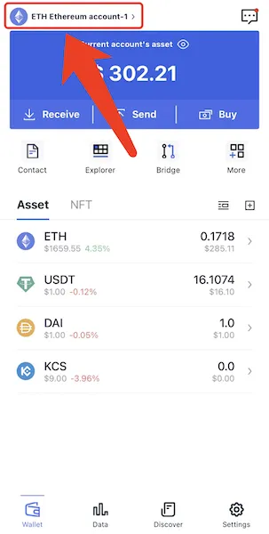
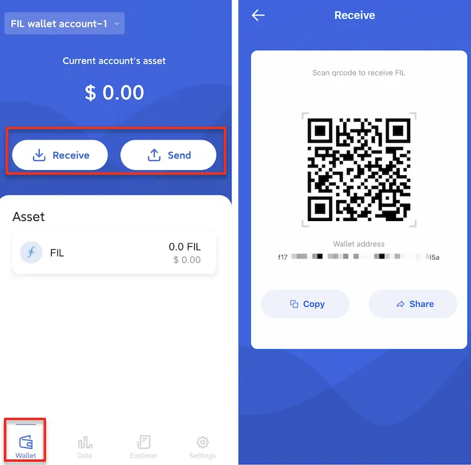
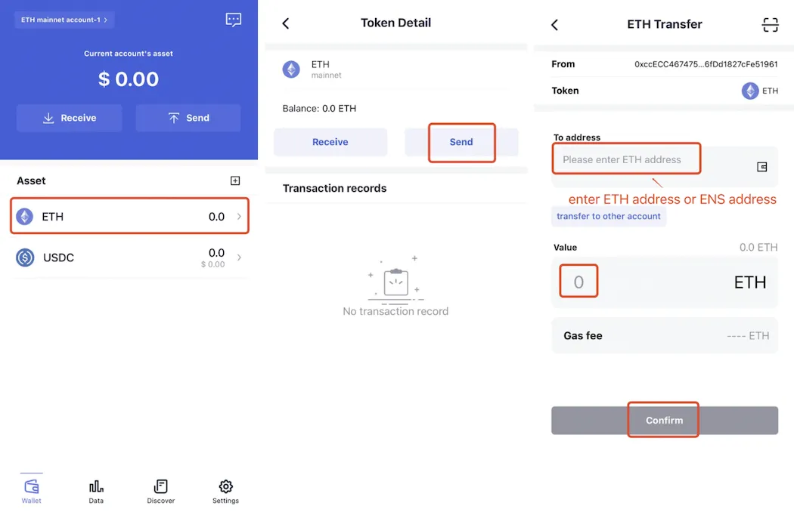
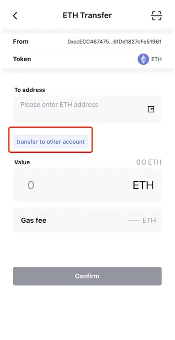
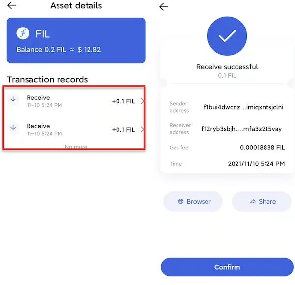

# Manage Funds

### Switch networks
FoxWallet supports multiple chains, you can switch them through the button in the top left corner of the “Wallet”

### Receive
Click the “Receive” button to get your wallet address.

### Send

Click the coin you want to send in wallet main page => Click “transfer” => Input address and amount => Click "confirm"。

Besides, FoxWallet offers the operation of "transfer between my accounts"。

### Transaction records
Click on the asset in the “Asset” list to enter the asset details page and view historical transaction records.

