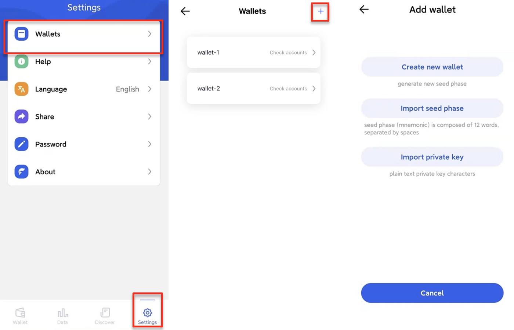
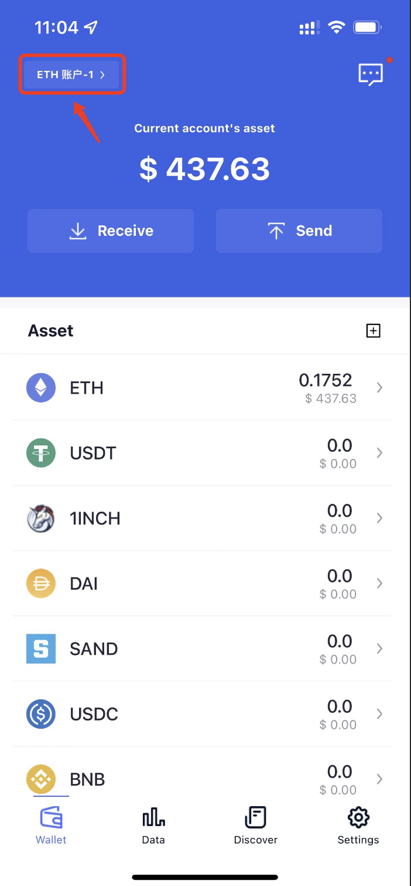
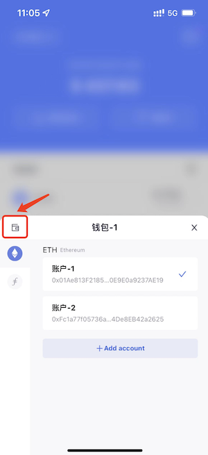
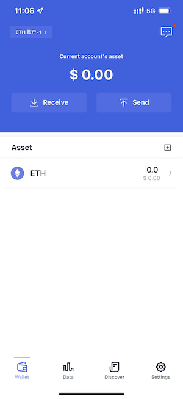
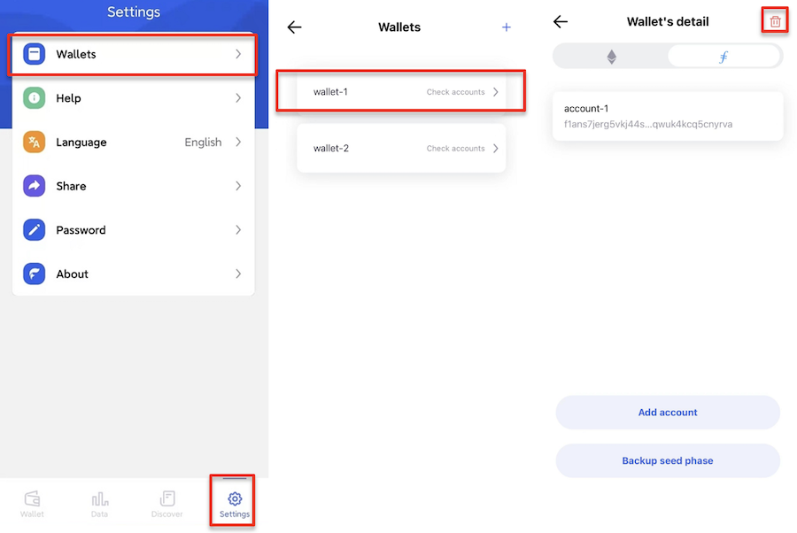
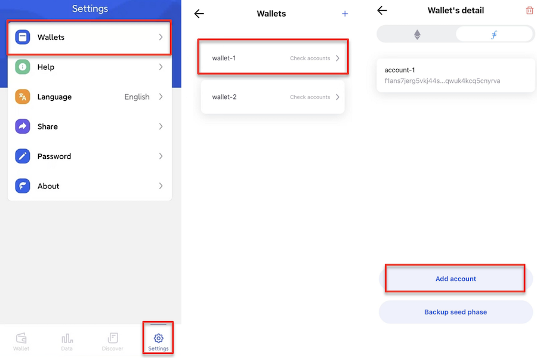
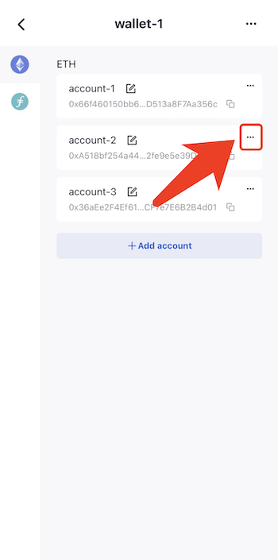
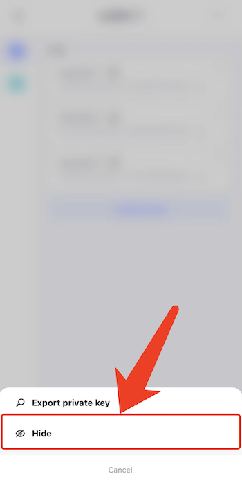

# Manage Wallets
FoxWallet supports importing multiple wallets through private key or mnemonic. In particular, the mnemonic type wallet is based on [BIP44 standard](https://github.com/bitcoin/bips/blob/master/bip-0044.mediawiki), so multiple accounts can be assigned, each with a unique address.  

You can view the "Manage Wallet" page via "Settings" => "Wallets", view/add/remove wallets and accounts. 

## Add wallet
Click the "+ Add wallet" button in "Wallets" page, select the corresponding method and follow the prompts to create or restore a wallet.

## Switch wallet
Click the switch button on the left-top corner of wallet screen.  

  

Click the manage icon on the left-top corner of pop-up screen.  

  

Select the wallet you want to switch to.  

  

Back to the wallet screen, new wallet is switched.  

  

## Delete wallet
Select the wallet that needs to be deleted, click the “...” button in the upper right corner, and then click “Delete”. 

After the wallet is deleted, it can only be restored by seed phrase or private key. 
Please make sure it has been properly backed up.

## Add account
You can derive multi accounts from one mnemonic to enhance the privacy and isolate risk.

Select the wallet that needs adding an account to in "Wallets" page, choose the chain, click “+ Add account” to operate. 

Note: only mnemonic wallets can add new accounts.

## Hide account
If you have more than one accounts, and want to delete one of them, the "Hide account" is your choice.

Go to "Wallets" page => select the wallet => choose the chain => click the "..." button on the top-right corner of account card => "Hide".

