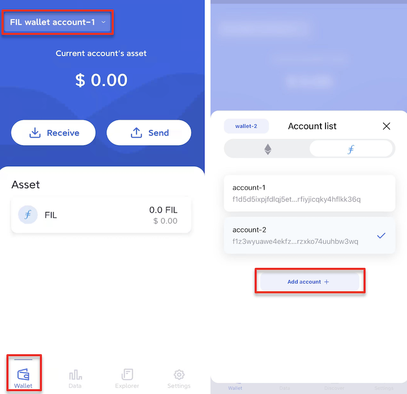

# Manage Wallet

## Import or Create
If you need to create or import another wallet in FoxWallet, you can access the page through “Settings” -> ”Wallets”. 

Click on the “+” in the upper right corner. 

Select the corresponding method and follow the prompts to create or restore a wallet.

## Add Account
There are two ways to add an account in Fox Wallet.

**Option 1**: Click the function button of switching wallets in the upper left corner of the” Wallet” page to enter the account list. Click “Add account”.

**Option 2**: Click “Wallets” on the “Settings” page. Select the wallet that needs adding an account to, and click “Add account” to finish.

## Delete Wallet
Enter the page through “Settings” -> ”Wallets”. 
Select the wallet that needs to be deleted, click the “Trash” button in the upper right corner, and then click “Delete” to finish. 
After the wallet is deleted, it can only be restored by seed phase or private key. 
Please make sure it has been properly backed up.

