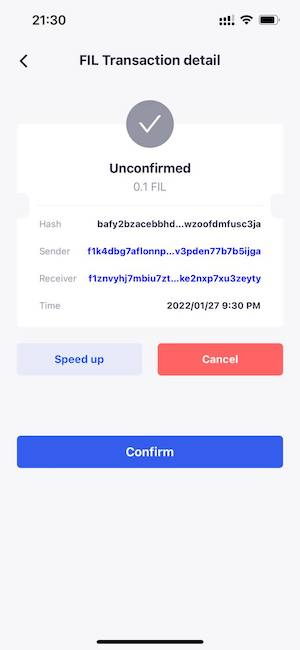

# Handle Pending Transaction

## Speed Up Transaction
If you have a transaction stuck in mempool, you can go to the "Transaction Detail" page, and click "Speed up" to re-broadcast your tx, FoxWallet will create a new transaction with higher gas.

If you have more than one transaction stuck, you need speed up the earliest one first. Only when the earliest get confirmed, the following transaction can be processed.

## Cancel Transaction
If you send a transaction by mistake, and luckily the transaction is not confirmed, you can go to the "Transaction Detail" page, and click "Cancel" to re-broadcast your tx, FoxWallet will create a new transaction sending funds to your self with higher gas.

