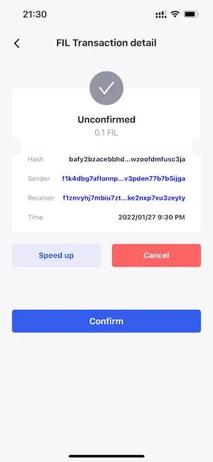

# 交易加速或取消

## 交易加速
如果您有交易卡在内存池中，您可以进入“交易详情”页面，点击“加速”重新广播您的交易，FoxWallet 将用更高的 Gas 创建一个新交易。

如果您有多笔交易卡住，您需要先加速最早的交易。只有最早的被打包后，才能处理后面的交易。

## 交易取消
如果您误发了一笔交易，幸运的是交易没有被确认，您可以进入“交易详情”页面，点击“取消”重新广播您的交易，FoxWallet 将用更高的 Gas 创建一个自己发给自己的交易，从而达到取消的效果，挽回资金损失。

