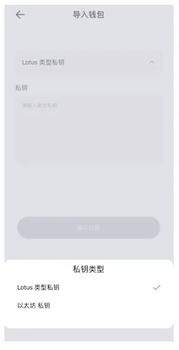

# 创建与导入钱包

打开钱包后，首先阅读并勾选《Fox钱包用户协议》。

### 如果已经有钱包，可以直接选择“导入钱包”

在 [FoxWallet](https://foxwallet.com) 中，可以通过助记词导入钱包，选择对应方式，根据页面提示输入信息之后，点击“确认创建”即完成恢复并进入钱包主页。

若选择用导入私钥的方式导入钱包，需先选择对应的链，再输入私钥，完成输入并确认后即进入钱包首页。

### 如果想创建新的钱包，则选择“创建钱包”
在FoxWallet中，您可以通过导入助记词来恢复钱包。根据页面提示输入信息, 点击“提交”完成导入。

如果您想通过导入私钥的方式恢复钱包，您需要先创建或导入助记词钱包，然后进入 “我”->“设置”->“切换钱包”->“添加钱包” 进行操作。