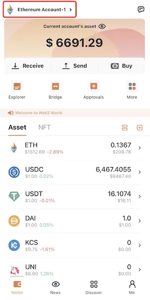

# zkSync 2.0 Alpha Testnet

[FoxWallet](https://foxwallet.com)是最好用的zkSync钱包，最好用的zkSync 2.0 Alpha Testnet钱包。

## 添加 zkSync Alpha Testnet

“我” => “管理网络” => 勾选 zkSync Alpha Testnet => 返回到钱包主页。

## 切换至 zkSync Alpha Testnet

点击钱包主页左上角的切换按钮 => 选择 zkSync Alpha Testnet => 选择一个账户。

## 获取测试币 和 体验跨链桥

访问 [zkSync 2.0 Testnet Tutorial](../dapp/zksync-v2-testnet)。

## 转账

FoxWallet 原生支持 zkSync 2.0 测试网的转账，只需点击钱包页的“发送”按钮, 然后填写转账地址和数额即可。

## Dapps

* https://testnet.switch.mute.io/
* https://syncswap.xyz/
* https://tofunft.com/zksync
* https://zksync-testnet.sat.is/