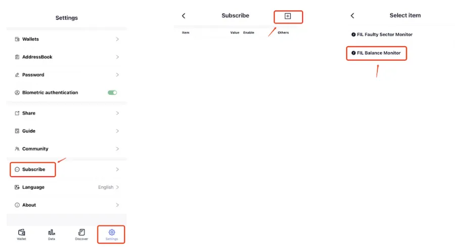
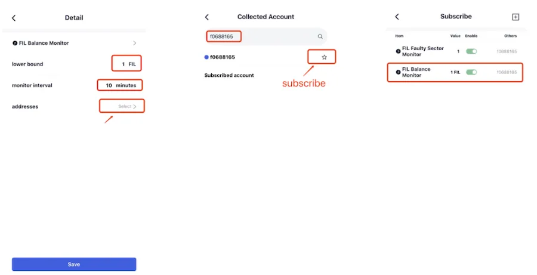

# 账户余额监控
余额不足监控可用于监控任意地址的FIL余额情况，可以方便矿工监控 Control 地址的余额，确保抽查时的上链手续费充足。

点击“设置”，选择“监控订阅”，点击页面右上方的“+”，选择“当前可用余额”。

进入设置FIL余额监控的详情页，根据实际需求设置“余额阈值”和“监控间隔”，并且点击“监控地址”，在搜索栏中搜索需要监控的账户并订阅，返回上一页，点击“保存”即订阅成功。

当 FoxWallet 检测到该账户的余额低于“余额阈值”，报警通知会推送到用户的手机上。

