# zkSync 1.0 使用教程

zkSync是一个使用[zkRollup 技术](https://docs.zksync.io/userdocs/tech.html#zk-rollup-architecture) 的低成本、无需信任的以太坊二层拓展协议，由 [Matter Labs](https://matter-labs.io/) 推出，使用零知识证明和链上数据可用性来保障用户的资产安全。

**zkSync的主要特点有：**
* 非常低的手续费
* 无需信任的协议
* 资产和以太坊Layer1有相同的安全等级
* 用户永远可以掌控自己的资产
* 无需开展运营活动以确保资金安全

zkSync 1.0 现已上线以太坊主网，支持转账和NFT。

打开 FoxWallet, [切换网络](../basic/manage-funds) 到 以太坊主网, 进入发现页，在搜索框输入网址 https://wallet.zksync.io/ 或者直接搜索zksync 进行访问。

选择 "Ethereum Wallet"。

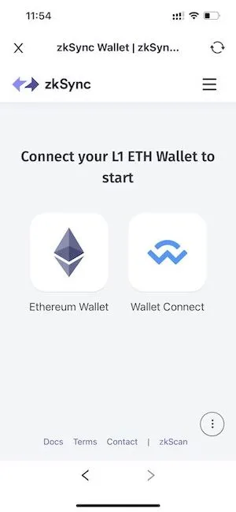

选择 "Metamask", 然后在弹出的页面里选择一个要连接的账户, 这样就进到了zkSync的钱包主页面。

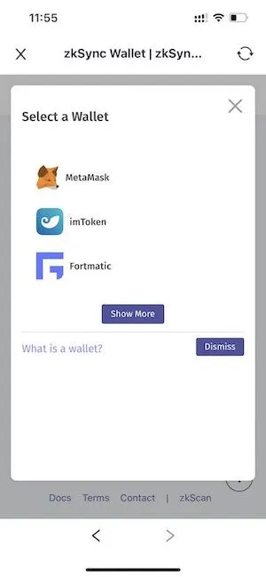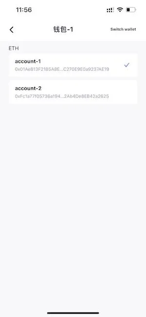

## 充值
充值功能是用来将Layer1的资产转移到Layer2中。

点击页面上的 "Add Funds" 按钮, 输入想要充值的金额, 然后点击下方的 "Add Funds".

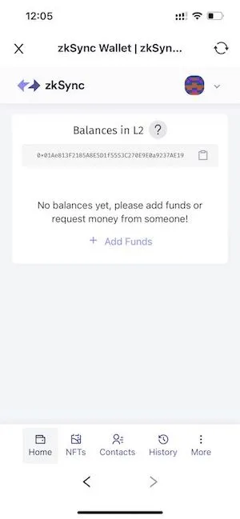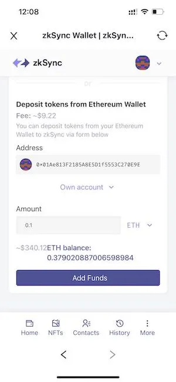

在弹出的页面中确定发送交易，等待几分钟让交易达到确认数，就充值好了。

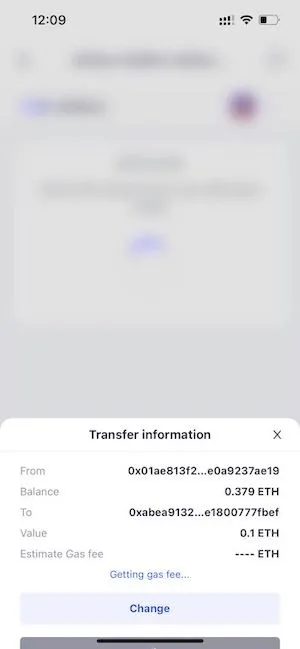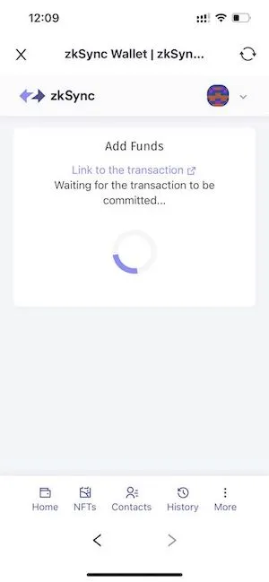

## 转账
点击页面上的 "Send" 按钮.

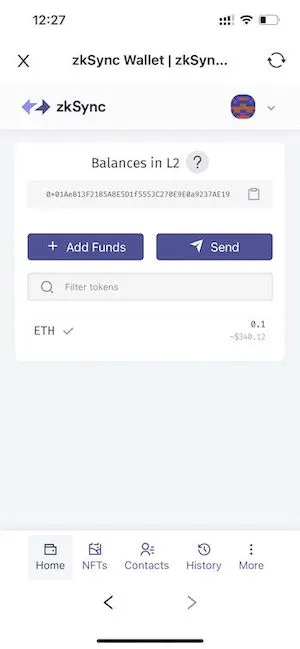

需要签名一段文字来激活你的账户。

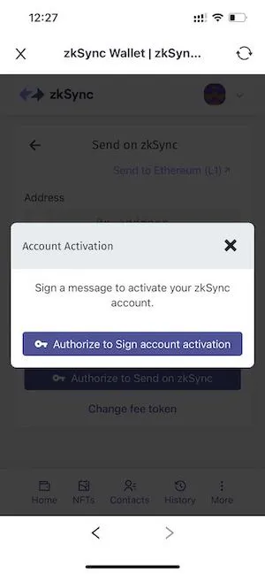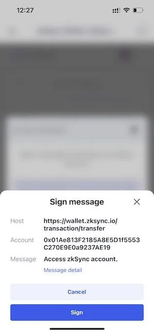

激活之后，输入要发送的地址和金额来转账。

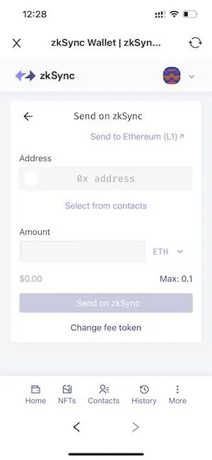

