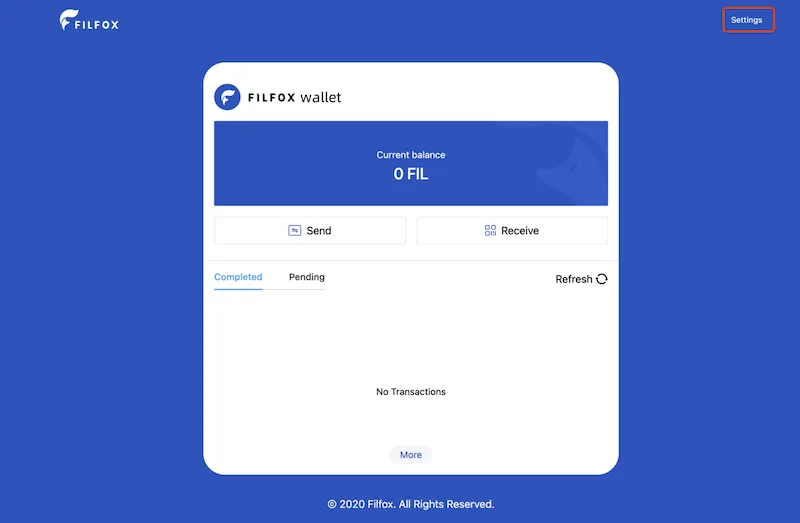
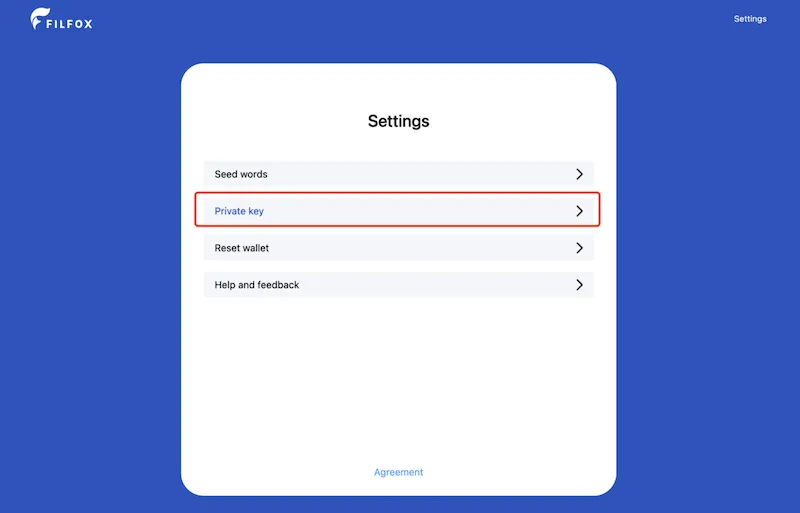

# 从 Filfox 网页钱包导入

由于一些历史原因，Filfox网页钱包 的助记词 和 其他主流钱包 不通用，如果将 Filfox网页钱包的助记词直接导入其他钱包会得到不同的地址。

本文介绍了一种通过私钥将 Filfox网页钱包 上的地址导入 FoxWallet 的办法。

## 1. 导出 Filfox 网页钱包的私钥

登陆网页钱包：[https://wallet.filfox.info](https://wallet.filfox.info)

点击 “设置” —> “私钥” —> 输入密码并确认 —> 复制私钥。

## 2. 将私钥导入到 FoxWallet

点击 "我" -> "设置" -> "切换钱包" 进入“管理钱包”页。

接着点击 "添加钱包" —> "导入私钥" —> 设置新钱包的名称 并选择 “Filecoin私钥” —> 粘贴上一步导出的私钥 —> 确定。

