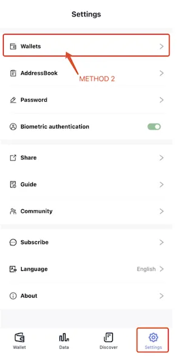
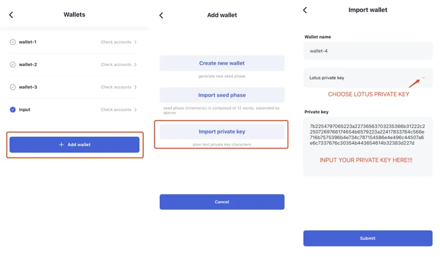
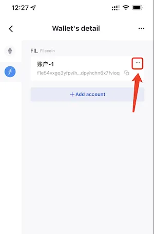
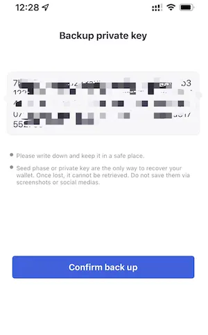

# 和 lotus 的交互

## 从 lotus 导入
### 1. 从 lotus 导出私钥

使用命令: `lotus wallet export [address]`

### 2. 导入私钥到 FoxWallet

点击 “我” Tab 里的 “管理钱包” 按钮。

点击 ”添加钱包“ —> 选择“导入私钥” —> 设置钱包名称 并选择 “Lotus 类型私钥” —> 输入从 lotus 导出的私钥 —> 确定。

## 导出到 lotus
### 1. 从 FoxWallet 导出私钥

进入“管理钱包”页, 选择对应的钱包进入“钱包详情”页。

点击对应账户卡片上的 "..." 按钮。  

在弹窗中选择 “导出私钥”。

私钥成功导出，复制下来。  

### 2. 导入私钥到 lotus  

使用命令: `echo [private key] | lotus wallet import`