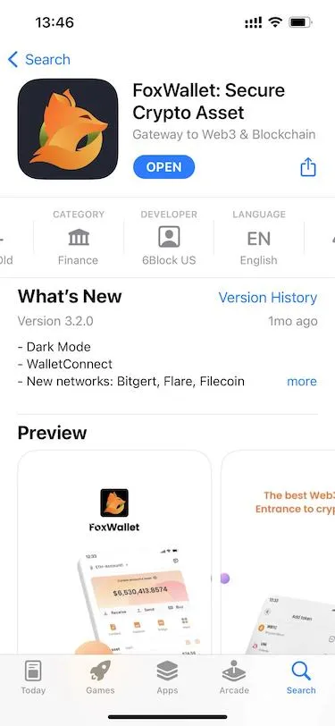
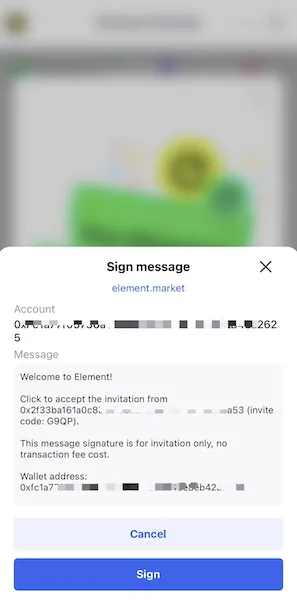
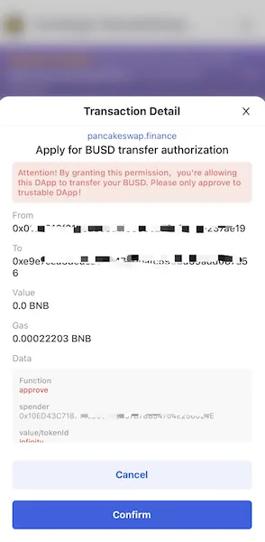

# 保护您的加密货币 - 安全提示

## 1. 从官方网站下载 FoxWallet

确保 FoxWallet 的官方网站域名为 **https://foxwallet.com**. 并且在域名前面有一个 [🔒] 符号，这表示“连接是安全的”。

当从 [AppStore](https://apps.apple.com/us/app/foxwallet-secure-crypto-asset/id1590983231) 下载时，请确保 DEVELOPER 名称是 6Block US。
 
当从 [Google Play](https://play.google.com/store/apps/details?id=com.foxwallet.play) 下载时，请确保 DEVELOPER 名称是 6Block。
  

## 2. 使用强密码

在创建钱包或加密货币交易所账户时，您始终需要使用极其安全的密码。

以下是创建强密码的一些提示：
* 使用字母、数字和特殊字符的组合
* 使用小写和大写字母
* 最少 8 个字符

## 3. 在安全的地方备份助记词

助记词是一个 12 或 24 个单词的短语，它是生成您持有的每种加密货币的私钥的核心。

您的助记词是您私钥的唯一备份，可以让您访问您的加密资产。

如果您丢失了助记词/私钥，您也会失去访问您的钱包的权限，没有任何例外。

* **永远不要截屏您的助记词**
* **永远不要将您的助记词存储在连接到互联网的任何应用程序或设备上。**
* **始终选择离线方法。虽然纸张和硬盘上的离线文档可以起到作用，但是钢制助记词板可以将您的助记词的安全性提升到一个新的水平**

## 4. 注意来自 DApps 的签名和交易

使用 DApps 时，FoxWallet 可以显示详细信息和风险操作的警告。

**您应该仔细检查网站域名、转移价值和目标、签名的消息内容、调用的函数，并注意警告信息。**

## 5. 警惕网络钓鱼诈骗

随着越来越多的人涉足加密货币领域，网络钓鱼诈骗越来越流行。

永远不要访问您不信任的网站。始终检查浏览器中显示的链接是否完全匹配您的交易所或网络钱包的链接。

骗子可以利用免费空投活动的海报或链接在社区中进行宣传。如果用户扫描代码、进入网站并同意接收空投代币，骗子就可以轻松地获得转移用户资产的权限。

另一种常见的骗局是伪造代币，骗子使用类似的代币名称和符号来制造伪造代币，然后将其兑换为真正的代币。在进行转账之前，有必要根据官方代币信息检查代币合同和其他信息，不要轻易相信第三方！

**世上没有免费的午餐，请勿点击任何未知链接以领取空投，或扫描未知的二维码。更重要的是，不要向任何人发送私钥/助记词！**

## 6. 手机比电脑更安全

与电脑不同，您手机上的每个应用程序都会创建一个单独的用户。这意味着，如果一个应用程序感染了一个用户，它就无法感染其他任何人的手机，除非该人给予该应用程序许可。

如果您需要在电脑上使用 DApp，我建议使用 FoxWallet 的 `WalletConnect` 功能。使用 `WalletConnect`，您可以在 DApps 和 FoxWallet 之间进行通信。
