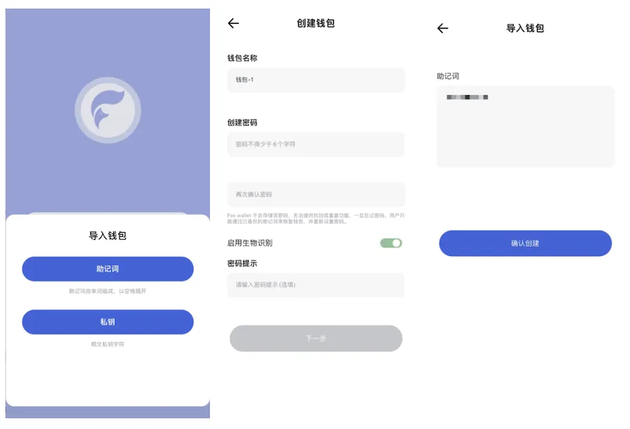
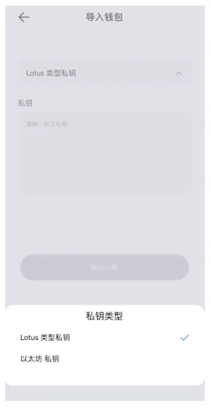
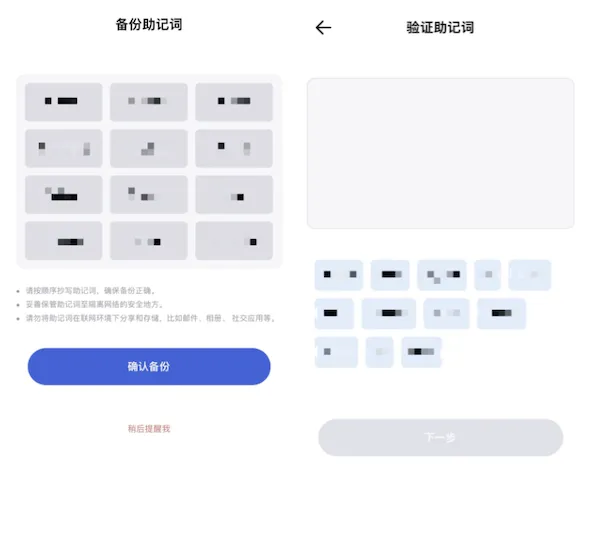

# 创建与导入钱包

打开钱包后，首先阅读并勾选《Fox钱包用户协议》。

### 如果已经有钱包，可以直接选择“导入钱包”

在 FoxWallet 中，可以通过导入助记词和导入私钥两种方式导入钱包，选择对应方式，根据页面提示输入信息之后，点击“确认创建”即完成恢复并进入钱包主页。

若选择用导入私钥的方式导入钱包，需先选择对应的链，再输入私钥，完成输入并确认后即进入钱包首页。

### 如果想创建新的钱包，则选择“创建钱包”
根据页面提示设置“钱包名称”、“密码”和“密码提示”。FoxWallet 服务器不存储密码和私钥助记词，也无法帮您找回，请务必牢记。

完成所有信息的输入后，点击确认。此时您的钱包已经创建好，可以选择即刻备份助记词或者稍后备份助记词。

若选择即刻备份助记词，在记录好助记词后，点击“确认备份”进入验证环节。根据您备份的助记词，按顺序将12个助记词依次输入验证框后，点击“下一步”，即完成备份。

