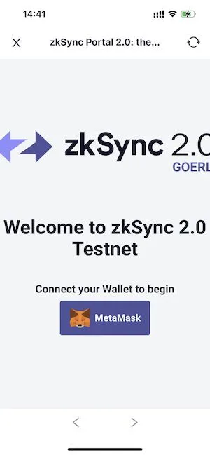

# zkSync 2.0 测试网使用教程
zkSync是一个使用[zkRollup 技术](https://docs.zksync.io/userdocs/tech.html#zk-rollup-architecture) 的低成本、无需信任的以太坊二层拓展协议，由 [Matter Labs](https://matter-labs.io/) 推出，使用零知识证明和链上数据可用性来保障用户的资产安全。

zkSync 2.0 是以太坊测试网上第一个与 EVM 兼容的 ZK Rollup。

## 添加以太坊 Goerli 测试网
zkSync 2.0 测试网部署在 以太坊的Goerli测试网上，所以得先添加Goerli测试网到钱包。

打开FoxWallet，进入设置页，点击“管理 ETH RPC”，滑动页面到最下方，点击按钮“添加自定义 RPC”。切换到Goerli后领取一些测试币。

具体的步骤可以参考：[以太坊测试网 Goerli (Görli)教程](../ethereum-advance/eth-goerli-testnet.md)。

## 连接钱包

进入发现页，在搜索框输入网址 https://portal.zksync.io/ 进行访问。

点击 "MetaMask" 按钮，在新页面中选择需要连接的FoxWallet 账户。

## 充值到Layer2
点击左上角的菜单按钮，在菜单中选择 “Bridge”，进入跨链桥页面。

在“Deposit” 选项下输入要充值的金额，点击下方 “Deposit” 按钮发起交易进行充值。

等待几分钟，交易达到确认数后即可在“Wallet”菜单下看到账户余额。

## 在Layer2中转账
在 “Wallet” 菜单下，切换到 “Transfer” 选项，输入对方的地址和金额大小，点击下方的“Transfer”按钮，签名交易，即可完成转账。

